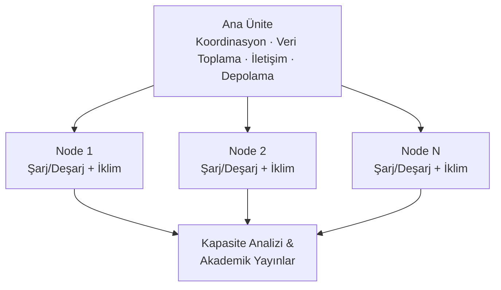

*🔋 TRONLOOP — Batarya Kapasite Kayıp İzleme Sistemi*

---

# Batarya Kapasite Kayıp İzleme Sistemi

> Ana ünite ve node'lardan oluşan, bataryaları sürekli şarj/deşarj döngüsüne alarak iklim koşullarıyla birlikte kapasite kayıplarını uzun vadeli izleyen araştırma platformu.

**Durum:** 🟡 Faz 1 — Kurulum Aşaması &nbsp;|&nbsp; **Başlangıç:** 2026 &nbsp;|&nbsp; **Son Güncelleme:** 2026-02-26

| | Faz 1 | Faz 2 |
|--|-------|-------|
| **Kapsam** | Temel şarj/deşarj + kapasite ölçümü | + İklim kontrol entegrasyonu |
| **İklimlendirme** | ❌ Yok — oda sıcaklığı | ✅ 10°C – 40°C kontrollü |
| **Durum** | 🟡 Aktif | ⚪ Faz 1 sonrası başlar |

---

## Hızlı Erişim

- [Proje Tanımı & Hedefler](docs/01-project-general/project-definition.md)
- [Ekip & Roller](docs/01-project-general/team.md)
- [Yol Haritası & Milestone'lar](docs/01-project-general/roadmap.md)
- [Ana Ünite Tasarımı](docs/02-hardware/main-unit.md)
- [Node Tasarımı](docs/02-hardware/node-design.md)
- [İklim İzleme](docs/02-hardware/climate-monitoring.md)
- [Malzeme Listesi (BOM)](docs/02-hardware/bill-of-materials.md)
- [Yazılım Mimarisi](docs/03-software/architecture.md)
- [Test Protokolü](docs/04-tests/test-protocol.md)
- [Literatür Taraması](docs/05-research/literature.md)
- [Yayın Planı](docs/05-research/publications.md)
- [AI Asistan Konfig](CLAUDE.md)
- [Değişiklik Geçmişi](CHANGELOG.md)

---

## Sistem Mimarisi (Özet)

---

## Proje Hakkında

Bu proje, bataryaların uzun vadeli kapasite kayıp davranışlarını sistematik olarak ölçmek ve belgelemek amacıyla tasarlanmıştır. Her node bağımsız şarj/deşarj döngüleri yürütürken iklim parametrelerini (sıcaklık, nem, vb.) eş zamanlı kaydeder. Toplanan veriler analiz edilerek akademik yayınlara dönüştürülür.

---

## Katkıda Bulunma

1. İlgili `docs/` alt klasörüne git
2. Değişikliğini yap, front matter'daki `son_guncelleme` ve `guncelleyen` alanlarını güncelle
3. `CHANGELOG.md` dosyasına kısa bir not ekle
4. Commit mesajı formatı: `docs(konu): kısa açıklama`

Detaylı talimatlar için [CLAUDE.md](CLAUDE.md) dosyasına bakınız.
