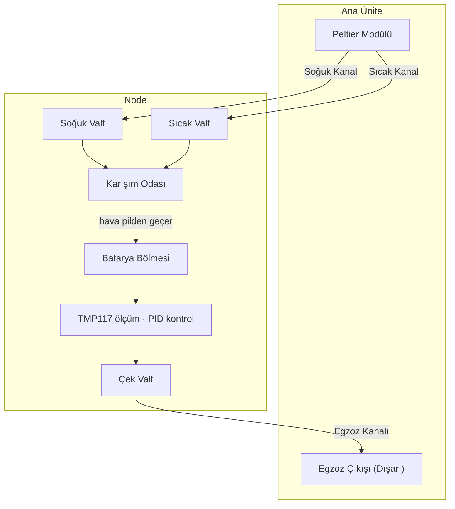
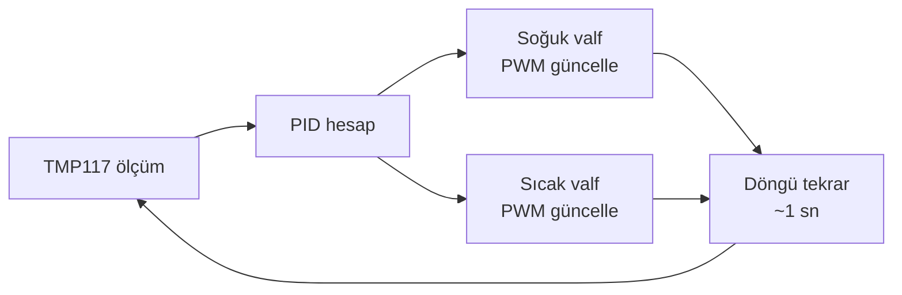

*🔋 TRONLOOP — Batarya Kapasite Kayıp İzleme Sistemi*

---
# İklim İzleme Sistemi

Her node, batarya yaşlanması üzerindeki iklim etkisini analiz edebilmek için ortam koşullarını elektriksel ölçümlerle eş zamanlı olarak kaydeder.

---

## İklim Kontrol Mimarisi

### Genel Yaklaşım

Merkezi Peltier modülü (ana ünitede) iki ayrı hava kanalı besler: biri soğuk taraftan, diğeri sıcak taraftan. Her node, bu iki kanaldan aldığı hava akışını bağımsız valfler aracılığıyla karıştırarak hedef ortam sıcaklığını dinamik olarak oluşturur.

### Valf Kontrolü

Her node iki bağımsız oransal valf içerir — biri soğuk kanala, biri sıcak kanala. İki valf birlikte kontrol edilerek hem toplam hava akışı hem de karışım oranı ayarlanabilir.

| Parametre | Açıklama |
|-----------|----------|
| Kontrol türü | PWM kontrollü oransal servo valf (her kanal için ayrı) |
| Geri bildirim | TMP117 ortam sıcaklığı ölçümü |
| Algoritma | PID — MCU (STM32L476) üzerinde çalışır |
| Bağımsızlık | Her node kendi sıcaklık hedefini bağımsız tutar |

**İki valfli yaklaşımın avantajı:** Yalnızca karışım oranı değil, toplam debi de kontrol edilebilir. Hızlı sıcaklık geçişlerinde her iki valf açılarak debi artırılır; kararlı durumda valfler kısılarak enerji tasarrufu sağlanır.

### Kontrol Döngüsü

### Egzoz Sistemi

Her node bölmesinin çıkışında bir **çek valf (check valve)** bulunur. Egzoz havası buradan tek yönlü olarak merkezi egzoz kanalına verilir; kanal ana ünite üzerinden dışarıya bağlanır. Çek valf, ana kanaldan geri akış olması durumunda komşu node'ların birbirini kirletmesini önler.

| Bileşen | Görev |
|---------|-------|
| Çek valf (node çıkışı) | Geri akışı engeller, node bölmesini izole eder |
| Merkezi egzoz kanalı | Tüm node egzozlarını ana üniteye taşır |
| Ana ünite egzoz çıkışı | Havayı dışarıya atar |

### Pilden Geçen Hava Akışı

Hava karışım odasından doğrudan pil yüzeyinin üzerinden geçerek egzoza ulaşır. Bu **zorla konveksiyon (forced convection)** düzenlemesi kasıtlı olarak tercih edilmiştir:

- Hedef sıcaklıktaki hava sürekli pil üzerinden aktığı için ısı transferi doğal konveksiyona göre çok daha hızlı ve homojen gerçekleşir
- Pil, hedef sıcaklığa daha kısa sürede ulaşır ve o sıcaklıkta sabit kalır
- Ticari iklim test odalarının çalışma prensibiyle birebir örtüşür
- Hava hızı çok yüksek tutulmamalıdır; aksi hâlde pil yüzeyinde lokal sıcaklık gradyanı oluşabilir

### Tasarım Notları

- Soğuk ve sıcak kanallar ısı kaybını önlemek için yalıtılmalıdır
- Yoğuşmayı önlemek için soğuk kanal iç yüzeyi nem geçirmez malzemeyle kaplanmalıdır
- Peltier boyutlandırması en kötü senaryoya göre yapılmalıdır: tüm node'ların eş zamanlı maksimum soğutma talebi
- Node bölmesi hava sızdırmaz tasarlanmalı; tek giriş (karışım odası) ve tek çıkış (egzoz çek valf) noktası olmalıdır

---

**İlgili Dosyalar:** [Node Tasarımı](node-design.md) · [Ana Ünite](main-unit.md) · [Veri Toplama](../03-software/data-collection.md)
