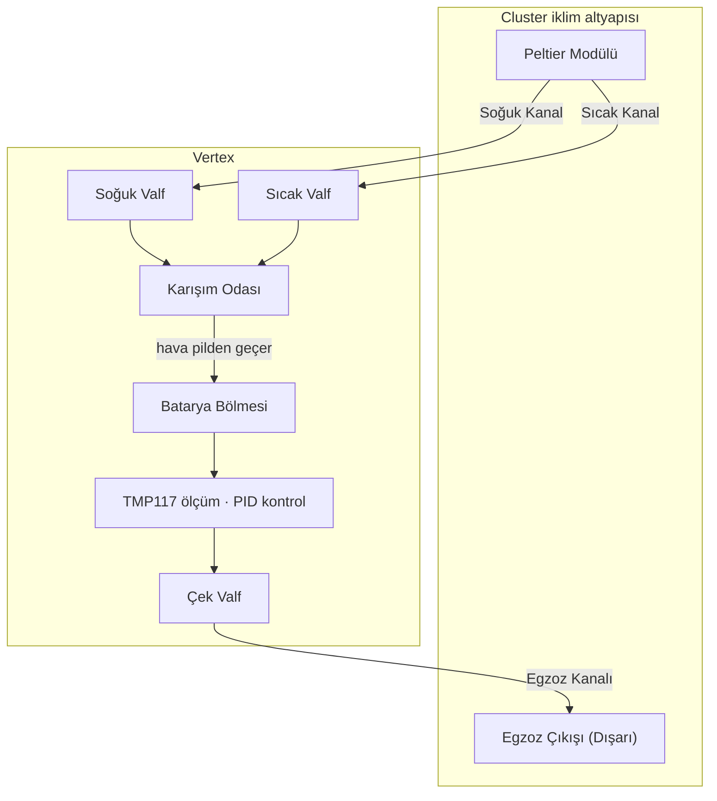
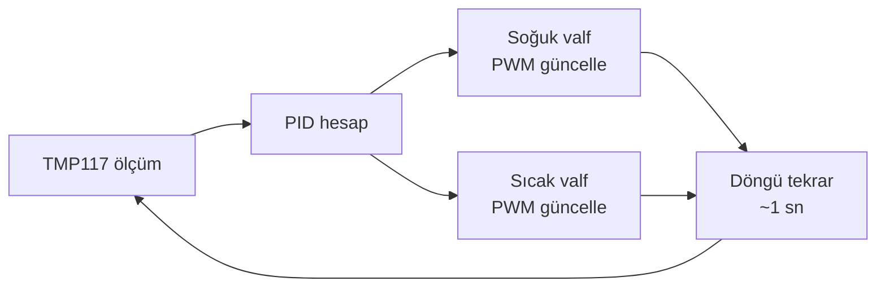
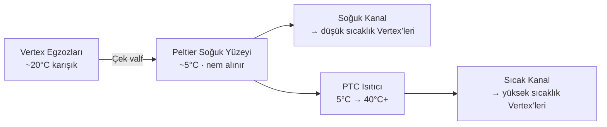
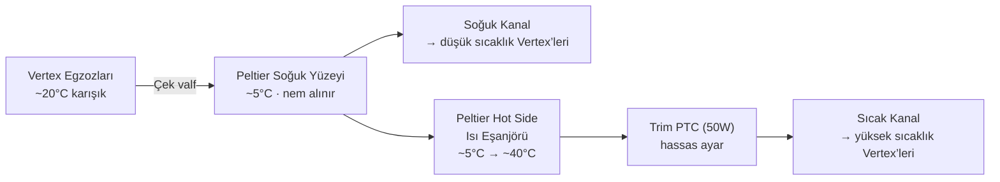
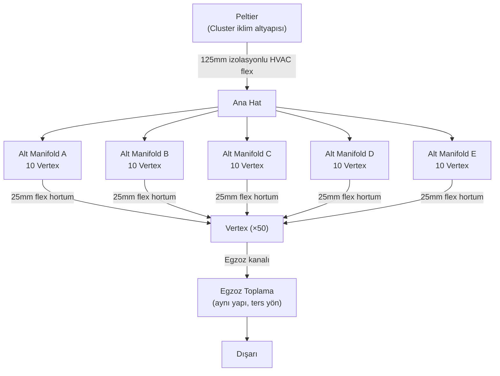
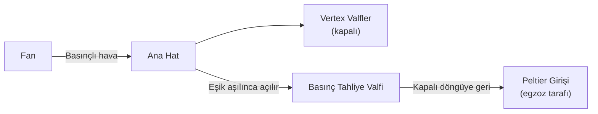

# İklim İzleme Sistemi

**Son Güncelleme:** 2026-09-18

> Bu sayfa **Faz 2 planı**. İlk aşamada oda sıcaklığında çalışıyoruz; temel sistemi doğruladıktan sonra iklim kontrolüne geçeceğiz. Aşağıdaki donanım düzeni henüz taslak.

Pilin hangi ortamda yaşlandığını bilmek istiyoruz. Bunun için sıcaklık ve diğer ortam verilerini elektriksel ölçümlerle birlikte kaydetmeyi planlıyoruz.

---

## İklim Kontrol Mimarisi

### Genel Yaklaşım

Soğuk kanalı **Peltier’in soğuk tarafından**, sıcak kanalı **PTC ısıtıcıyla** beslemeyi düşünüyoruz. Sıcak kanalın hedefini yalnızca Peltier’in sıcak yüzeyine bağlamak istemiyoruz: soğutma için o yüzeyi de soğutunca istediğimiz 40°C’yi bulamayabiliriz. PTC ile iki kanalı ayrı ayarlayabiliyoruz.

```
T_soğuk = T_sıcak − ΔT_aktif

→ Soğuk tarafı düşürmek için sıcak tarafı soğutursun
→ Ama sıcak tarafı soğutunca hot side kanalı için 40°C üretemezsin
→ Çözüm: hot side kanalını Peltier'den değil PTC ısıtıcıdan besle
```

| Kanal | Kaynak | Sıcaklık aralığı |
|-------|--------|------------------|
| Soğuk | Peltier soğuk tarafı | ~5°C (nem alma) → düşük Vertex sıcaklıkları |
| Sıcak | PTC ısıtıcı | 24°C → 40°C+ (bağımsız kontrol) |

Cluster’daki merkezi Peltier hem soğuk havayı hazırlayacak hem de nemi alacak. Her Vertex, sıcak ve soğuk kanaldan gelen havayı kendi valfleriyle karıştırıp hedef sıcaklığını tutacak.


```mermaid
flowchart TD
    subgraph ANA["Cluster iklim altyapısı"]
        P["Peltier Modülü"]
        EX["Egzoz Çıkışı (Dışarı)"]
    end

    P -->|Soğuk Kanal| SV["Soğuk Valf"]
    P -->|Sıcak Kanal| HV["Sıcak Valf"]

    subgraph NODE["Vertex"]
        SV
        HV
        SV & HV --> MIX["Karışım Odası"]
        MIX -->|"hava pilden geçer"| BAT["Batarya Bölmesi"]
        BAT --> TMP["TMP117 ölçüm · PID kontrol"]
        TMP --> CV["Çek Valf"]
    end

    CV -->|Egzoz Kanalı| EX
```

### Valf Kontrolü

Her Vertex için iki oransal valf düşünüyoruz: biri sıcak, biri soğuk hava için. İkisini ayrı kontrol edince hem karışım oranını hem toplam debiyi ayarlayabiliyoruz.

| Parametre | Açıklama |
|-----------|----------|
| Kontrol türü | PWM kontrollü oransal servo valf (her kanal için ayrı) |
| Geri bildirim | TMP117 ortam sıcaklığı ölçümü |
| Algoritma | PID — MCU (STM32L476) üzerinde çalışır |
| Bağımsızlık | Her Vertex kendi sıcaklık hedefini bağımsız tutar |

Hızlı sıcaklık değişimi gerektiğinde iki valfi de açıp debiyi artırabiliriz. Sıcaklık oturunca akışı kısarız. İki valf kullanma fikrinin nedeni bu esneklik.

### Kontrol Döngüsü


```mermaid
flowchart LR
    T["TMP117 ölçüm"] --> P["PID hesap"]
    P --> SV["Soğuk valf<br/>PWM güncelle"]
    P --> HV["Sıcak valf<br/>PWM güncelle"]
    SV & HV --> L["Döngü tekrar<br/>~1 sn"]
    L --> T
```

### Egzoz ve Kapalı Döngü Sistemi

Sistem **kapalı döngü** olarak çalışır — dışarıdan sürekli taze hava çekmek yerine aynı hava dolaştırılır. Her Vertex bölmesinin çıkışındaki **çek valf** egzozu merkezi toplama kanalına yönlendirir; buradan tüm hava Cluster altyapısındaki **Peltier soğuk yüzeyine** gönderilir.


```mermaid
flowchart LR
    N["Vertex Egzozları<br/>~20°C karışık"] -->|"Çek valf"| PC["Peltier Soğuk Yüzeyi<br/>~5°C · nem alınır"]
    PC --> SC["Soğuk Kanal<br/>→ düşük sıcaklık Vertex’leri"]
    PC --> PTC["PTC Isıtıcı<br/>5°C → 40°C+"]
    PTC --> HC["Sıcak Kanal<br/>→ yüksek sıcaklık Vertex’leri"]
```

Peltier soğuk yüzeyi hem **soğuk hava kaynağı** hem de **nem alma** noktasıdır. Yoğuşan su drene edilir; kuru hava iki yola ayrılır.

**Sıcak kanal için ısıtma — iki aşamalı:**
Kuru soğuk hava (~5°C) önce **Peltier hot side ısı eşanjöründen** geçer. Hot side zaten ~40-50°C'de olduğundan hava burada ~35-45°C'ye çıkar. Arkasından küçük bir **trim PTC (50W)** hassas ayarı tamamlar. Bu sayede Peltier'in atık ısısı değerlendirilmiş olur, PTC yalnızca fark kadar çalışır.


```mermaid
flowchart LR
    N["Vertex Egzozları<br/>~20°C karışık"] -->|"Çek valf"| PC["Peltier Soğuk Yüzeyi<br/>~5°C · nem alınır"]
    PC --> SC["Soğuk Kanal<br/>→ düşük sıcaklık Vertex’leri"]
    PC --> HS["Peltier Hot Side<br/>Isı Eşanjörü<br/>~5°C → ~40°C"]
    HS --> PTC["Trim PTC (50W)<br/>hassas ayar"]
    PTC --> HC["Sıcak Kanal<br/>→ yüksek sıcaklık Vertex’leri"]
```

| Bileşen | Görev |
|---------|-------|
| Çek valf (Vertex çıkışı) | Geri akışı engeller, Vertex bölmesini izole eder |
| Merkezi egzoz kanalı | Tüm Vertex egzozlarını Peltier soğuk yüzeyine taşır |
| Peltier soğuk yüzeyi | Soğuk hava üretimi + nem alma (kondenzasyon tuzağı) |
| Kondenzat drenajı | Yoğuşan suyu en alt noktadan tahliye eder |
| Peltier hot side ısı eşanjörü | Atık ısıyı geri kazanır, soğuk havayı ~40°C'ye çeker |
| Trim PTC ısıtıcı (50W) | Son hassas sıcaklık ayarı, TMP117 + PID ile kontrol |

### Pilden Geçen Hava Akışı

Karışan havayı doğrudan pilin üzerinden geçirip egzoza almak istiyoruz. **Zorlanmış taşınım** kullanmamızın nedeni, pil ile hava arasındaki ısı alışverişini hızlandırmak:

- Hedef sıcaklıktaki hava sürekli pil üzerinden aktığı için ısı transferi doğal konveksiyona göre çok daha hızlı ve homojen gerçekleşir
- Pil, hedef sıcaklığa daha kısa sürede ulaşır ve o sıcaklıkta sabit kalır
- Ticari iklim test odalarının çalışma prensibiyle birebir örtüşür
- Hava hızı çok yüksek tutulmamalıdır; aksi hâlde pil yüzeyinde lokal sıcaklık gradyanı oluşabilir

### Tasarım Notları

- Soğuk ve sıcak kanallar ısı kaybını önlemek için yalıtılmalıdır
- Yoğuşmayı önlemek için soğuk kanal iç yüzeyi nem geçirmez malzemeyle kaplanmalıdır
- Peltier boyutlandırması en kötü senaryoya göre yapılmalıdır: tüm Vertex’lerin eş zamanlı maksimum soğutma talebi
- Vertex bölmesi hava sızdırmaz tasarlanmalı; tek giriş (karışım odası) ve tek çıkış (egzoz çek valf) noktası olmalıdır

---

## Boru ve Manifold Sistemi (50 Vertex)

### Yapı

50 Vertex’lik taslakta 10’ar cihazlık 5 grup var. Her grubun bir alt manifoldu olacak; hepsi ana hattan beslenecek.


```mermaid
flowchart TD
    P["Peltier<br/>(Cluster iklim altyapısı)"] -->|"125mm izolasyonlu HVAC flex"| AM["Ana Hat"]
    AM --> M1["Alt Manifold A<br/>10 Vertex"]
    AM --> M2["Alt Manifold B<br/>10 Vertex"]
    AM --> M3["Alt Manifold C<br/>10 Vertex"]
    AM --> M4["Alt Manifold D<br/>10 Vertex"]
    AM --> M5["Alt Manifold E<br/>10 Vertex"]
    M1 & M2 & M3 & M4 & M5 -->|"25mm flex hortum"| N["Vertex (×50)"]
    N -->|"Egzoz kanalı"| EM["Egzoz Toplama<br/>(aynı yapı, ters yön)"]
    EM --> OUT["Dışarı"]
```

> Sistem iki kez kurulur: biri soğuk kanal, biri sıcak kanal için. Egzoz tarafı 25mm → 63mm → 125mm olarak toplar.

### Boyutlar

| Bileşen | Çap | Malzeme | Not |
|---------|-----|---------|-----|
| Ana hat | 125mm | İzolasyonlu HVAC flex | Soğuk + sıcak için ayrı |
| Alt manifold giriş | 63mm | 3D baskı PETG | 10 Vertex başına 1 adet |
| Alt manifold çıkış | 10 × 25mm | 3D baskı PETG | 150mm aralıklı |
| Alt manifold boyu | 1500mm | 3D baskı PETG | 10 × 150mm Vertex aralığı |
| Vertex bağlantısı | 25mm | İzolasyonlu HVAC flex | Maks 1.5m |
| Duvar kalınlığı | 3mm | PETG | Manifold gövdesi |

### Debi ve Basınç

| Parametre | Değer |
|-----------|-------|
| Vertex başına debi | 10 L/min |
| Alt manifold toplam debi | 100 L/min |
| Ana hat toplam debi | 500 L/min |
| Sistem basınç kaybı | ~80 Pa |
| Fan gereksinimi | Min. 500 L/min @ 80 Pa statik basınç |

### Basınç Tahliye Valfi

Kapalı döngüde tüm Vertex valflerinin eş zamanlı kapanması durumunda kanal içinde basınç birikir ve fan zarar görür. Bunu önlemek için ana hatta **yay yüklü pasif basınç tahliye valfi** bulunur.


```mermaid
flowchart LR
    FAN["Fan"] -->|"Basınçlı hava"| ANA["Ana Hat"]
    ANA --> N["Vertex Valfler<br/>(kapalı)"]
    ANA -->|"Eşik aşılınca açılır"| BTV["Basınç Tahliye Valfi"]
    BTV -->|"Kapalı döngüye geri"| PG["Peltier Girişi<br/>(egzoz tarafı)"]
```

Fazla hava dışarı atılmaz — kapalı döngüde Peltier girişine (egzoz tarafına) geri yönlendirilir. Valf mekaniktir, elektrik gerektirmez ve yazılım arızasına karşı bağımsız çalışır.

| Parametre | Değer |
|-----------|-------|
| Tür | Yay yüklü pasif (ayarlı) |
| Eşik basınç | ~100 Pa (sistem nominal basıncının ~%25 üzeri) |
| Bağlantı | Ana hat → Peltier egzoz girişi |
| Kontrol | Mekanik, yazılımdan bağımsız |

Yazılım tarafında da bütün valfler kapandığında fan hızını düşürmeyi planlıyoruz. Mekanik tahliye valfi ise yazılımdan bağımsız kalacak.

### Manifold Tasarım İpuçları (Onshape / 3D Baskı)

- İç çap boyunca sabit kesit (plenum tasarımı) → tüm çıkışlara eşit basınç
- Çıkış fittingleri 45° açılı yerleştirilirse akış dağılımı iyileşir
- Soğuk manifold iç yüzeyi pürüzsüz olmalı; yoğuşma birikintisi oluşmaması için en alçak noktaya tahliye deliği eklenebilir
- PETG yeterli; sıcak kanal 60°C'yi geçmeyeceği için PLA kullanılmamalı

---

**İlgili Dosyalar:** [Vertex Tasarımı](node-design.md) · [ClusterPilot ve Cluster Altyapısı](main-unit.md) · [Veri Toplama](../03-software/data-collection.md)
