*🔋 TRONLOOP — Batarya Kapasite Kayıp İzleme Sistemi*

---
# İklim İzleme Sistemi

> ⚠️ **Bu belge Faz 2 kapsamındadır.** Faz 1'de iklimlendirme sistemi devrede değildir; node'lar oda sıcaklığında çalışır. İklim kontrol entegrasyonu Faz 1 doğrulandıktan sonra başlar.

Her node, batarya yaşlanması üzerindeki iklim etkisini analiz edebilmek için ortam koşullarını elektriksel ölçümlerle eş zamanlı olarak kaydeder.

---

## İklim Kontrol Mimarisi

### Genel Yaklaşım

Soğuk kanal **Peltier soğuk tarafından**, sıcak kanal ise bağımsız bir **PTC ısıtıcıdan** beslenir. Bu ayrım kritiktir: sıcak taraf için 40°C hedeflendiğinde Peltier hot side'ının yeterince sıcak olması garanti edilemez — özellikle soğuk tarafı düşük tutmak için sıcak taraf aktif soğutuluyorsa. PTC ısıtıcı bu bağımlılığı ortadan kaldırır, iki kanalı birbirinden bağımsız kontrol edilebilir kılar.

```
T_soğuk = T_sıcak − ΔT_aktif

→ Soğuk tarafı düşürmek için sıcak tarafı soğutursun
→ Ama sıcak tarafı soğutunca hot side kanalı için 40°C üretemezsin
→ Çözüm: hot side kanalını Peltier'den değil PTC ısıtıcıdan besle
```

| Kanal | Kaynak | Sıcaklık aralığı |
|-------|--------|------------------|
| Soğuk | Peltier soğuk tarafı | ~5°C (nem alma) → düşük node sıcaklıkları |
| Sıcak | PTC ısıtıcı | 24°C → 40°C+ (bağımsız kontrol) |

Merkezi Peltier modülü (ana ünitede) soğuk kanalı besler ve kapalı döngüde nem alma görevini üstlenir. PTC ısıtıcı sıcak kanalı bağımsız olarak ısıtır. Her node, bu iki kanaldan aldığı hava akışını bağımsız valfler aracılığıyla karıştırarak hedef ortam sıcaklığını dinamik olarak oluşturur.



```mermaid
flowchart TD
    subgraph ANA["Ana Ünite"]
        P["Peltier Modülü"]
        EX["Egzoz Çıkışı (Dışarı)"]
    end

    P -->|Soğuk Kanal| SV["Soğuk Valf"]
    P -->|Sıcak Kanal| HV["Sıcak Valf"]

    subgraph NODE["Node"]
        SV
        HV
        SV & HV --> MIX["Karışım Odası"]
        MIX -->|"hava pilden geçer"| BAT["Batarya Bölmesi"]
        BAT --> TMP["TMP117 ölçüm · PID kontrol"]
        TMP --> CV["Çek Valf"]
    end

    CV -->|Egzoz Kanalı| EX
```

### Valf Kontrolü

Her node iki bağımsız oransal valf içerir — biri soğuk kanala, biri sıcak kanala. İki valf birlikte kontrol edilerek hem toplam hava akışı hem de karışım oranı ayarlanabilir.

| Parametre | Açıklama |
|-----------|----------|
| Kontrol türü | PWM kontrollü oransal servo valf (her kanal için ayrı) |
| Geri bildirim | TMP117 ortam sıcaklığı ölçümü |
| Algoritma | PID — MCU (STM32L476) üzerinde çalışır |
| Bağımsızlık | Her node kendi sıcaklık hedefini bağımsız tutar |

**İki valfli yaklaşımın avantajı:** Yalnızca karışım oranı değil, toplam debi de kontrol edilebilir. Hızlı sıcaklık geçişlerinde her iki valf açılarak debi artırılır; kararlı durumda valfler kısılarak enerji tasarrufu sağlanır.

### Kontrol Döngüsü

```mermaid
flowchart LR
    T["TMP117 ölçüm"] --> P["PID hesap"]
    P --> SV["Soğuk valf<br/>PWM güncelle"]
    P --> HV["Sıcak valf<br/>PWM güncelle"]
    SV & HV --> L["Döngü tekrar<br/>~1 sn"]
    L --> T
```



### Egzoz ve Kapalı Döngü Sistemi

Sistem **kapalı döngü** olarak çalışır — dışarıdan sürekli taze hava çekmek yerine aynı hava dolaştırılır. Her node bölmesinin çıkışındaki **çek valf** egzozu merkezi toplama kanalına yönlendirir; buradan tüm hava ana ünitedeki **Peltier soğuk yüzeyine** gönderilir.

```mermaid
flowchart LR
    N["Node Egzozları<br/>~20°C karışık"] -->|"Çek valf"| PC["Peltier Soğuk Yüzeyi<br/>~5°C · nem alınır"]
    PC --> SC["Soğuk Kanal<br/>→ düşük sıcaklık nodeları"]
    PC --> PTC["PTC Isıtıcı<br/>5°C → 40°C+"]
    PTC --> HC["Sıcak Kanal<br/>→ yüksek sıcaklık nodeları"]
```



Peltier soğuk yüzeyi hem **soğuk hava kaynağı** hem de **nem alma** noktasıdır. Yoğuşan su drene edilir; kuru hava iki yola ayrılır.

**Sıcak kanal için ısıtma — iki aşamalı:**
Kuru soğuk hava (~5°C) önce **Peltier hot side ısı eşanjöründen** geçer. Hot side zaten ~40-50°C'de olduğundan hava burada ~35-45°C'ye çıkar. Arkasından küçük bir **trim PTC (50W)** hassas ayarı tamamlar. Bu sayede Peltier'in atık ısısı değerlendirilmiş olur, PTC yalnızca fark kadar çalışır.

```mermaid
flowchart LR
    N["Node Egzozları<br/>~20°C karışık"] -->|"Çek valf"| PC["Peltier Soğuk Yüzeyi<br/>~5°C · nem alınır"]
    PC --> SC["Soğuk Kanal<br/>→ düşük sıcaklık nodeları"]
    PC --> HS["Peltier Hot Side<br/>Isı Eşanjörü<br/>~5°C → ~40°C"]
    HS --> PTC["Trim PTC (50W)<br/>hassas ayar"]
    PTC --> HC["Sıcak Kanal<br/>→ yüksek sıcaklık nodeları"]
```



| Bileşen | Görev |
|---------|-------|
| Çek valf (node çıkışı) | Geri akışı engeller, node bölmesini izole eder |
| Merkezi egzoz kanalı | Tüm node egzozlarını Peltier soğuk yüzeyine taşır |
| Peltier soğuk yüzeyi | Soğuk hava üretimi + nem alma (kondenzasyon tuzağı) |
| Kondenzat drenajı | Yoğuşan suyu en alt noktadan tahliye eder |
| Peltier hot side ısı eşanjörü | Atık ısıyı geri kazanır, soğuk havayı ~40°C'ye çeker |
| Trim PTC ısıtıcı (50W) | Son hassas sıcaklık ayarı, TMP117 + PID ile kontrol |

### Pilden Geçen Hava Akışı

Hava karışım odasından doğrudan pil yüzeyinin üzerinden geçerek egzoza ulaşır. Bu **zorla konveksiyon (forced convection)** düzenlemesi kasıtlı olarak tercih edilmiştir:

- Hedef sıcaklıktaki hava sürekli pil üzerinden aktığı için ısı transferi doğal konveksiyona göre çok daha hızlı ve homojen gerçekleşir
- Pil, hedef sıcaklığa daha kısa sürede ulaşır ve o sıcaklıkta sabit kalır
- Ticari iklim test odalarının çalışma prensibiyle birebir örtüşür
- Hava hızı çok yüksek tutulmamalıdır; aksi hâlde pil yüzeyinde lokal sıcaklık gradyanı oluşabilir

### Tasarım Notları

- Soğuk ve sıcak kanallar ısı kaybını önlemek için yalıtılmalıdır
- Yoğuşmayı önlemek için soğuk kanal iç yüzeyi nem geçirmez malzemeyle kaplanmalıdır
- Peltier boyutlandırması en kötü senaryoya göre yapılmalıdır: tüm node'ların eş zamanlı maksimum soğutma talebi
- Node bölmesi hava sızdırmaz tasarlanmalı; tek giriş (karışım odası) ve tek çıkış (egzoz çek valf) noktası olmalıdır

---

## Boru ve Manifold Sistemi (50 Node)

### Yapı

50 node, 5 adet 10'lu gruba bölünür. Her grup bir alt manifolda bağlanır; alt manifoldlar ana hattan beslenir.

```mermaid
flowchart TD
    P["Peltier\n(Ana Ünite)"] -->|"125mm izolasyonlu HVAC flex"| AM["Ana Hat"]
    AM --> M1["Alt Manifold A\n10 node"]
    AM --> M2["Alt Manifold B\n10 node"]
    AM --> M3["Alt Manifold C\n10 node"]
    AM --> M4["Alt Manifold D\n10 node"]
    AM --> M5["Alt Manifold E\n10 node"]
    M1 & M2 & M3 & M4 & M5 -->|"25mm flex hortum"| N["Node (×50)"]
    N -->|"Egzoz kanalı"| EM["Egzoz Toplama\n(aynı yapı, ters yön)"]
    EM --> OUT["Dışarı"]
```



> Sistem iki kez kurulur: biri soğuk kanal, biri sıcak kanal için. Egzoz tarafı 25mm → 63mm → 125mm olarak toplar.

### Boyutlar

| Bileşen | Çap | Malzeme | Not |
|---------|-----|---------|-----|
| Ana hat | 125mm | İzolasyonlu HVAC flex | Soğuk + sıcak için ayrı |
| Alt manifold giriş | 63mm | 3D baskı PETG | 10 node başına 1 adet |
| Alt manifold çıkış | 10 × 25mm | 3D baskı PETG | 150mm aralıklı |
| Alt manifold boyu | 1500mm | 3D baskı PETG | 10 × 150mm node aralığı |
| Node bağlantısı | 25mm | İzolasyonlu HVAC flex | Maks 1.5m |
| Duvar kalınlığı | 3mm | PETG | Manifold gövdesi |

### Debi ve Basınç

| Parametre | Değer |
|-----------|-------|
| Node başına debi | 10 L/min |
| Alt manifold toplam debi | 100 L/min |
| Ana hat toplam debi | 500 L/min |
| Sistem basınç kaybı | ~80 Pa |
| Fan gereksinimi | Min. 500 L/min @ 80 Pa statik basınç |

### Basınç Tahliye Valfi

Kapalı döngüde tüm node valflerinin eş zamanlı kapanması durumunda kanal içinde basınç birikir ve fan zarar görür. Bunu önlemek için ana hatta **yay yüklü pasif basınç tahliye valfi** bulunur.

```mermaid
flowchart LR
    FAN["Fan"] -->|"Basınçlı hava"| ANA["Ana Hat"]
    ANA --> N["Node Valfler\n(kapalı)"]
    ANA -->|"Eşik aşılınca açılır"| BTV["Basınç Tahliye Valfi"]
    BTV -->|"Kapalı döngüye geri"| PG["Peltier Girişi\n(egzoz tarafı)"]
```



Fazla hava dışarı atılmaz — kapalı döngüde Peltier girişine (egzoz tarafına) geri yönlendirilir. Valf mekaniktir, elektrik gerektirmez ve yazılım arızasına karşı bağımsız çalışır.

| Parametre | Değer |
|-----------|-------|
| Tür | Yay yüklü pasif (ayarlı) |
| Eşik basınç | ~100 Pa (sistem nominal basıncının ~%25 üzeri) |
| Bağlantı | Ana hat → Peltier egzoz girişi |
| Kontrol | Mekanik, yazılımdan bağımsız |

**İkincil güvence:** MCU tüm node valflerinin kapandığını tespit ederse fan hızını da düşürür. Donanım + yazılım çift katmanlı koruma sağlar.

### Manifold Tasarım İpuçları (Onshape / 3D Baskı)

- İç çap boyunca sabit kesit (plenum tasarımı) → tüm çıkışlara eşit basınç
- Çıkış fittingleri 45° açılı yerleştirilirse akış dağılımı iyileşir
- Soğuk manifold iç yüzeyi pürüzsüz olmalı; yoğuşma birikintisi oluşmaması için en alçak noktaya tahliye deliği eklenebilir
- PETG yeterli; sıcak kanal 60°C'yi geçmeyeceği için PLA kullanılmamalı

---

**İlgili Dosyalar:** [Node Tasarımı](node-design.md) · [Ana Ünite](main-unit.md) · [Veri Toplama](../03-software/data-collection.md)
