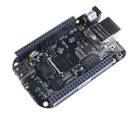

# ClusterPilot ve Cluster Altyapısı

**Son Güncelleme:** 2026-09-18

Bu sayfada ilk tasarım notları duruyor. İsimleri güncelledik ama aşağıdaki bütün seçimleri yeniden doğrulamadık. Güncel yapı için [mimari notlara](../03-software/architecture-notes.md) bakıyoruz; burası geçmişte düşündüğümüz seçenekleri kaybetmemek için duruyor.

ClusterPilot, Vertex’lerden veriyi toplayıp buluta taşıyan Linux sunucusu. Bu sayfada onun için düşündüğümüz platformun yanında Cluster’ın ortak güç altyapısına ait eski notlar da var.

## İşlemci / Platform

**BeagleBone Black Rev C — TI AM3358BZCZ**



| Parametre | Değer |
|-----------|-------|
| İşlemci | AM3358BZCZ ARM Cortex-A8 @ 1GHz |
| RAM | 512MB DDR3 |
| Depolama | 4GB eMMC + microSD |
| İşletim Sistemi | Linux (Debian) |
| Real-time | 2x PRU @200MHz (deterministik zamanlama) |
| Yazılım dili | Python |

## İletişim

Vertex’lerle haberleşme **CAN bus** üzerinden yapılır. AM3358 dahili **2x DCAN kontrolcüsü** içerir — harici CAN IC gerekmez.

| Parametre | Değer |
|-----------|-------|
| Protokol | CAN bus (CAN 2.0A / 2.0B — belirlenecek) |
| Baud rate | — kbps |
| Topoloji | Multi-drop bus, her Vertex paralel |
| Sonlandırma | Her iki uçta 120 Ω |
| Vertex adresleme | Her Vertex’e benzersiz CAN ID |
| Linux CAN stack | SocketCAN + can-utils |

---

**İlgili Dosyalar:** [Vertex Tasarımı](node-design.md) · [Malzeme Listesi](bill-of-materials.md) · [Yazılım Mimarisi](../03-software/architecture.md)

## Cluster Altyapısı ve Yedeklilik (Eski Tasarım)

İlk yedeklilik planındaki hedef, sistemi yıllarca çalıştırabilmekti. Tek bir parçanın arızası bütün sistemi durdurmasın diye aşağıdaki düzeni düşünmüştük.

### BeagleBone — 2x Aktif/Standby

| Rol | Durum | Görev |
|-----|-------|-------|
| Primary BBB | Aktif | CAN bus yönetimi, veri toplama, depolama |
| Secondary BBB | Hot standby | Primary'yi izler, heartbeat kesilirse otomatik devralır |

Her iki BBB da donanımsal watchdog timer ile korunur.

**Tek CAN Bus:** Tüm Vertex’ler tek bir CAN hattı üzerinden her iki BBB'a da bağlıdır. Primary çökerse secondary aynı hat üzerinden devralır — Vertex’ler geçişi fark etmez. AM3358'in ikinci DCAN kontrolcüsü ileride genişleme veya debug için boşta bekler.

```
Vertex’ler ──── CAN Bus (DCAN0) ──┬── Primary BBB (aktif)
                                └── Secondary BBB (standby)
```

### Rezerv Pil Paketi — 3x (N+1)

2 paket aktif, 1 paket bakımda veya yedekte. Bir paket devre dışı kalırsa sistem kalan 2 paketle çalışmaya devam eder. Her paketin bağımsız BMS'i ve 48V bus'a bağlı bidirectional DC-DC regülatörü vardır.

### Vertex Arızası

Bu planda bir Vertex arızalanırsa heartbeat kaybından fark ediyor, kayda alıyor ve o testi daha sonra tekrarlıyoruz. Hedef, diğer Vertex’lerin çalışmaya devam etmesi.

### Güç

48V omurga bus'a çift bağımsız güç yolu. BBB'lar ve CAN elektroniği için UPS/tampon kondansatör — güç kesintisinde güvenli kapanma süresi sağlar.
