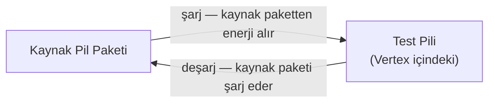
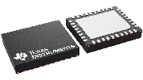
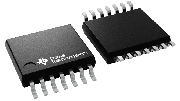
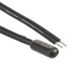
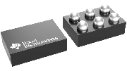
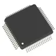

# Vertex Tasarımı

**Son Güncelleme:** 2026-09-18

Her Vertex bir pili test ediyor. Şarj/deşarj senaryosunu kendi çalıştırmasını, elektriksel ölçümlerle birlikte pil ve ortam sıcaklığını kaydetmesini istiyoruz. Bu sayfa donanım taslağı; bütün ölçümlerin firmware’de hazır olduğu anlamına gelmiyor.

> **Faz 1’de** oda sıcaklığında çalışacağız. Planda TMP117 ve NTC ile sıcaklık kaydı var, iklim kontrolü yok. Hava kanalları ve valfler **Faz 2’ye** kalıyor. Sıcaklık okuma kodu henüz tamamlanmadı.

## Enerji Döngüsü (Loop) Mimarisi

Deşarj sırasında enerjiyi kaynak pakete geri vermeyi planlıyoruz. Döngü şöyle:

```mermaid
flowchart LR
    KP["Kaynak Pil Paketi"]
    TP["Test Pili<br/>(Vertex içindeki)"]
    KP -->|"şarj — kaynak paketten enerji alır"| TP
    TP -->|"deşarj — kaynak paketi şarj eder"| KP
```

Buradaki fikir, deşarj enerjisini ısı olarak harcamak yerine kaynak pakete geri göndermek. Test pilinden daha yüksek gerilimli kaynak pakete geçişte boost yönünü kullanıyoruz.

## Güç Yönetimi

Şarjı ve deşarjı aynı **çift yönlü DC-DC dönüştürücü** üzerinden yönetiyoruz.

**Seçilen IC: BQ25756 (Texas Instruments)**

[📄 Datasheet](https://www.ti.com/lit/ds/symlink/bq25756.pdf)

1–14 hücre Li-ion / LFP destekli, I2C programlanabilir bidirectional buck-boost kontrolcü.

| Parametre | Değer |
|-----------|-------|
| Hücre desteği | 1–14 hücre Li-ion / LFP |
| Giriş voltajı | 4.2V – 70V |
| Max şarj akımı | 10A |
| Max deşarj akımı | 20A (giriş akım regülasyonu) |
| Kontrol | I2C + standalone (pin programlanabilir) |
| Özellikler | Bidirectional, ICO, MPPT, JEITA, ADC entegre |

**3Ah hücre için C hızı kapasitesi:**

| Yön | Max Akım | Max C Hızı |
|-----|----------|------------|
| Şarj | 10A | **3.3C** |
| Deşarj | 20A* | **6.6C** |

*Pratik limit harici MOSFET ve bobine bağlı.

> Bu seçimde hedefimiz EV profilindeki anlık 3C–4C deşarjı ve akım geçişlerini karşılamak. Son sınırları kart üzerinde doğrulayacağız.

## Kapasite Ölçümü

**BQ34Z100 (Texas Instruments)**

[📄 Datasheet](https://www.ti.com/lit/ds/symlink/bq34z100-r2.pdf)

Kapasite ve SoH takibinde BQ34Z100’den yararlanmayı düşünüyoruz. LFP’nin gerilim eğrisi düz olduğu için yalnızca gerilime bakarak SoC tahmini yapmak istemiyoruz; akımın zaman içindeki toplamı da önemli.

### Impedance Track™ Algoritması

BQ34Z100, kapasite hesabında TI’ın **Impedance Track™** algoritmasını kullanıyor. Buradaki ilgimiz, coulomb sayımının yanında pilin empedansını da hesaba katması.

| Özellik | Açıklama |
|---------|----------|
| İç empedans takibi | Yaşlanma, sıcaklık ve akıma göre değişen empedansı modellenler |
| SoH tespiti | Empedans artışı → kapasite kaybı doğrudan raporlanır |
| LFP uyumu | Düz voltaj eğrisine bağımlı değil, coulomb + empedans bazlı |
| Dinamik profil | EV gibi değişken akım profillerinde de doğru çalışır |

Bu takip, pil yaşlandıkça empedansın ve kullanılabilir kapasitenin nasıl değiştiğini görmemize yardımcı olabilir. SoH sonucunu referans kapasite testleriyle de karşılaştıracağız.

### Pil Sıcaklığı Ölçümü

**BN35-3H103FB-50 (TDK) — NTC Termistör**

Pil yüzeyine temas ettirilerek BQ34Z100'ün `TS` (Temperature Sense) pinine bağlanır. Gauge bu sinyali dahili ADC ile okuyarak sıcaklık kompanzasyonunu ve JEITA korumalarını otomatik uygular.

| Parametre | Değer |
|-----------|-------|
| Direnç (25°C) | 10 kΩ |
| Tolerans | ±1% |
| B sabiti (25/50°C) | 3380 K |
| Çalışma aralığı | -40°C / +125°C |
| Bağlantı | BQ34Z100 TS pini (voltage divider ile) |

> Sıcaklık verisi hem Impedance Track™ algoritmasının doğruluğunu artırır hem de MCU üzerinden iklim veri setine dahil edilir.

### Ortam Sıcaklığı Ölçümü

**TMP117 (Texas Instruments) — Dijital Sıcaklık Sensörü**

[📄 Datasheet](https://www.ti.com/lit/ds/symlink/tmp117.pdf)

TMP117’yi pilin bulunduğu ortamı ölçmek için kullanmayı planlıyoruz. MCU’ya I2C üzerinden bağlanıyor. Pil yüzeyiyle ortamı ayrı ölçerek pilin ne kadar ısındığını takip edebileceğiz.

| Parametre | Değer |
|-----------|-------|
| Doğruluk | ±0.1°C (tipik), ±0.3°C (maks, -20°C / +50°C) |
| Çözünürlük | 16-bit (0.0078°C/LSB) |
| Çalışma aralığı | -55°C / +150°C |
| Arayüz | I2C (4 adrese kadar adreslenebilir) |
| Güç tüketimi | 3.5 µA (sürekli dönüşüm) |

> Pil ve ortam sıcaklığını birlikte tutacağız; böylece yaşlanma verisini incelerken pilin ısınmasını da görebileceğiz.

## Mikrodenetleyici (MCU)

##### STM32L476RG (STMicroelectronics)
Dev board: Nucleo-L476RG. Üretimde daha küçük paket olan STM32L476CB (LQFP48) kullanılacak.

| Parametre | Değer |
|-----------|-------|
| Çekirdek | ARM Cortex-M4 @ 80MHz |
| Flash / RAM | 1MB / 128KB |
| CAN | 1x bxCAN (CAN 2.0 uyumlu) |
| I2C | 3x (BQ25756 + BQ34Z100 için) |
| ADC | 12-bit |
| Sıcaklık | -40°C / +85°C |
| Güç tüketimi | Düşük güç modları — yıllarca kesintisiz çalışma için uygun |

## İletişim

ClusterPilot ile **CAN bus** üzerinden haberleşir. Her Vertex’e benzersiz CAN ID atanır.

---

**İlgili Dosyalar:** [ClusterPilot](main-unit.md) · [İklim İzleme](climate-monitoring.md) · [Test Protokolü](../04-tests/test-protocol.md)
