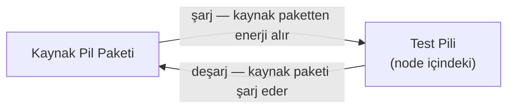

---
# Node Tasarımı

Her node bağımsız olarak bir test bataryasını şarj/deşarj döngüsüne alır; elektriksel parametreler ve iklim koşullarını ölçer.

> **Faz 1** kapsamında node, iklimlendirme olmadan oda sıcaklığında çalışır. TMP117 ve NTC termistör Faz 1'de de mevcuttur; sıcaklık verisi kaydedilir ancak iklim kontrolü yapılmaz. Hava kanalı bağlantıları ve valf mekanizması **Faz 2** ile devreye girer.

## Enerji Döngüsü (Loop) Mimarisi

Sistem regeneratif bir döngü üzerine kuruludur:

Deşarj enerjisi israf olmaz, kaynak pakete geri beslenir. Düşük voltajlı test pilinden yüksek voltajlı kaynak pakete enerji aktarımı IC'nin dahili boost dönüştürücüsü ile sağlanır.

## Güç Yönetimi

Şarj ve deşarj tek bir **çift yönlü (bidirectional) DC-DC dönüştürücü** ile yönetilir.

**Seçilen IC: BQ25756 (Texas Instruments)**

1–14 hücre Li-ion / LFP destekli, I2C programlanabilir bidirectional buck-boost kontrolcü.

| Parametre | Değer |
|-----------|-------|
| Hücre desteği | 1–14 hücre Li-ion / LFP |
| Giriş voltajı | 4.2V – 70V |
| Max şarj akımı | 10A |
| Max deşarj akımı | 20A (giriş akım regülasyonu) |
| Kontrol | I2C + standalone (pin programlanabilir) |
| Özellikler | Bidirectional, ICO, MPPT, JEITA, ADC entegre |

**3Ah hücre için C hızı kapasitesi:**

| Yön | Max Akım | Max C Hızı |
|-----|----------|------------|
| Şarj | 10A | **3.3C** |
| Deşarj | 20A* | **6.6C** |

*Pratik limit harici MOSFET ve bobine bağlı.

> EV profili (anlık 3C–4C deşarj, dinamik akım geçişleri) bu IC ile rahatlıkla karşılanır.

## Kapasite Ölçümü

**BQ34Z100 (Texas Instruments)**

Her iki yönde coulomb sayımı yaparak anlık kapasite ve SoH değerlerini raporlar. LFP'nin düz voltaj eğrisinde SoC tespiti için kritik — voltaj bazlı tahmin bu kimyada güvenilmez.

### Impedance Track™ Algoritması

TI'ın tescilli **Impedance Track™** algoritması BQ34Z100'ün temel teknolojisidir. Basit coulomb sayımının ötesinde, bataryanın iç empedansını sürekli ölçerek gerçek kullanılabilir kapasiteyi hesaplar.

| Özellik | Açıklama |
|---------|----------|
| İç empedans takibi | Yaşlanma, sıcaklık ve akıma göre değişen empedansı modellenler |
| SoH tespiti | Empedans artışı → kapasite kaybı doğrudan raporlanır |
| LFP uyumu | Düz voltaj eğrisine bağımlı değil, coulomb + empedans bazlı |
| Dinamik profil | EV gibi değişken akım profillerinde de doğru çalışır |

Bu proje için kritik avantaj: batarya yaşlandıkça artan iç empedans zaten izleniyor — SoH trendini ayrıca hesaplamaya gerek kalmıyor.

### Pil Sıcaklığı Ölçümü

**BN35-3H103FB-50 (TDK) — NTC Termistör**

Pil yüzeyine temas ettirilerek BQ34Z100'ün `TS` (Temperature Sense) pinine bağlanır. Gauge bu sinyali dahili ADC ile okuyarak sıcaklık kompanzasyonunu ve JEITA korumalarını otomatik uygular.

| Parametre | Değer |
|-----------|-------|
| Direnç (25°C) | 10 kΩ |
| Tolerans | ±1% |
| B sabiti (25/50°C) | 3380 K |
| Çalışma aralığı | -40°C / +125°C |
| Bağlantı | BQ34Z100 TS pini (voltage divider ile) |

> Sıcaklık verisi hem Impedance Track™ algoritmasının doğruluğunu artırır hem de MCU üzerinden iklim veri setine dahil edilir.

### Ortam Sıcaklığı Ölçümü

**[TMP117 (Texas Instruments)](https://www.ti.com/lit/ds/symlink/tmp117.pdf) — Dijital Sıcaklık Sensörü**

Pilin bulunduğu ortam sıcaklığını ölçer. I2C üzerinden doğrudan MCU'ya bağlanır. Yüksek hassasiyeti sayesinde pil yüzeyi ile ortam sıcaklığı arasındaki fark (ısınma etkisi) analiz edilebilir.

| Parametre | Değer |
|-----------|-------|
| Doğruluk | ±0.1°C (tipik), ±0.3°C (maks, -20°C / +50°C) |
| Çözünürlük | 16-bit (0.0078°C/LSB) |
| Çalışma aralığı | -55°C / +150°C |
| Arayüz | I2C (4 adrese kadar adreslenebilir) |
| Güç tüketimi | 3.5 µA (sürekli dönüşüm) |

> Ortam ve yüzey sıcaklığı birlikte kaydedilerek pil ısınma profili uzun vadeli degradasyon analizine dahil edilir.

## Mikrodenetleyici (MCU)

##### STM32L476RG (STMicroelectronics)
Dev board: Nucleo-L476RG. Üretimde daha küçük paket olan STM32L476CB (LQFP48) kullanılacak.

| Parametre | Değer |
|-----------|-------|
| Çekirdek | ARM Cortex-M4 @ 80MHz |
| Flash / RAM | 1MB / 128KB |
| CAN | 1x bxCAN (CAN 2.0 uyumlu) |
| I2C | 3x (BQ25756 + BQ34Z100 için) |
| ADC | 12-bit |
| Sıcaklık | -40°C / +85°C |
| Güç tüketimi | Düşük güç modları — yıllarca kesintisiz çalışma için uygun |

## İletişim

Ana üniteyle **CAN bus** üzerinden haberleşir. Her node'a benzersiz CAN ID atanır.

---

**İlgili Dosyalar:** [Ana Ünite](main-unit.md) · [İklim İzleme](climate-monitoring.md) · [Test Protokolü](../04-tests/test-protocol.md)
