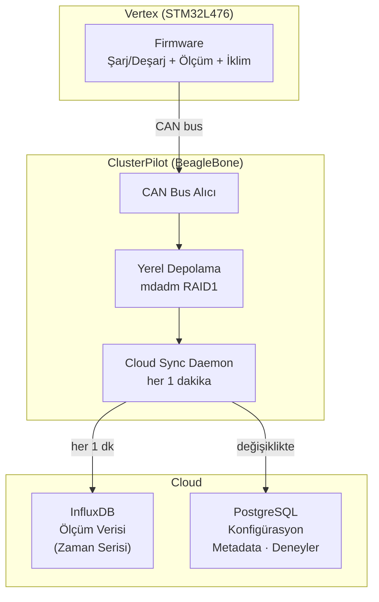

# İlk yazılım mimarisi — arşiv

Bu sayfa eski planın kaydı. Bugünkü sistem için [güncel mimariye](architecture.md) bakıyoruz.

**Son Güncelleme:** 2026-09-18

Bu sayfada ilk tasarım notları duruyor. İsimleri güncelledik ama aşağıdaki bütün seçimleri yeniden doğrulamadık. Güncel yapı için [mimari notlara](architecture-notes.md) bakıyoruz; burası geçmişte düşündüğümüz seçenekleri kaybetmemek için duruyor.

İlk planda yazılımı Vertex firmware’i, ClusterPilot ve analiz araçları olarak üçe ayırmıştık. Vertex–ClusterPilot arasında CAN, buluta aktarım için de dakikada bir eşitleme düşünülüyordu. Aşağıdaki diyagram ve veritabanı tabloları o plana ait.

---

## Katmanlar



---

## Veritabanı Mimarisi

### InfluxDB — Ölçüm Verisi (Zaman Serisi)

Ölçümleri zaman serisi olarak saklamak için InfluxDB düşünülmüştü. Sık gelen kayıtları yazmak ve zaman içindeki değişimi sorgulamak bu seçimin nedeniydi. Aşağıdaki servis ve paket bilgileri eski notlar; güncel koşulları ayrıca kontrol etmek gerekiyor.

| Parametre | Değer |
|-----------|-------|
| Tür | Zaman serisi veritabanı (TSDB) |
| Dev ortamı | Docker — `docker run influxdb:2` |
| Prod ortamı | InfluxDB Cloud (AWS üzerinde, ücretsiz tier) |
| Retention | Ücretsiz tier: 30 gün · Ücretli: sınırsız |
| Client | Python `influxdb-client` |
| Sync sıklığı | Her 1 dakika |

**Ölçüm yapısı (measurement: `battery_data`):**

| Field | Tip | Açıklama |
|-------|-----|----------|
| `voltage` | float | Anlık voltaj (V) |
| `current` | float | Anlık akım (A) |
| `capacity` | float | Kalan kapasite (mAh) |
| `soh` | float | State of Health (%) |
| `temp_surface` | float | Pil yüzey sıcaklığı °C (NTC) |
| `temp_ambient` | float | Ortam sıcaklığı °C (TMP117) |
| `cycle_count` | int | Döngü sayısı |

**Tag'lar:**

| Tag | Açıklama |
|-----|----------|
| `node_id` | CAN ID (1–50) |
| `experiment_id` | Hangi deneye ait |
| `cell_type` | Batarya kimyası (LFP, NMC vb.) |

---

### PostgreSQL — Konfigürasyon ve Metadata

Deney tanımlarını, Vertex ayarlarını ve pil bilgilerini PostgreSQL’de tutmayı düşünmüştük.

| Parametre | Değer |
|-----------|-------|
| Tür | İlişkisel veritabanı |
| Dev ortamı | Docker — `docker run postgres:15` |
| Prod ortamı | Amazon RDS PostgreSQL (fully managed) |
| Client | Python `psycopg2` / `SQLAlchemy` |
| Sync | Konfigürasyon değişikliklerinde |

**Temel tablolar:**

| Tablo | İçerik |
|-------|--------|
| `experiments` | Deney adı, başlangıç/bitiş, hedef parametreler |
| `nodes` | Vertex ID, seri no, kurulum tarihi |
| `cells` | Batarya bilgileri (kapasite, kimya, yaş) |
| `test_profiles` | Şarj/deşarj protokol tanımları |
| `system_config` | ClusterPilot ve Vertex konfigürasyonları |

---

## Yerel Depolama

Yerel depolama için iki USB SSD üzerinde **mdadm RAID1** planlanmıştı. Bağlantı yokken kayıtlar burada bekleyecek, bağlantı gelince buluta gidecekti. Güncel kararda SQLite kuyruğu var; RAID düzeni henüz yeniden kesinleştirilmedi.

| Bileşen | Açıklama |
|---------|----------|
| Depolama | 2× USB SSD, mdadm RAID1 |
| Format | Ham ölçüm: CSV · Offline buffer: SQLite |
| Offline buffer | Bağlantı yokken SQLite'a yaz, bağlantı gelince InfluxDB'ye flush |
| Yedek | Haftalık rsync → harici sürücü veya NAS |

---

## Docker Compose (Dev Ortamı)

İlk planı yerelde denemek için hazırlanan Compose örneği:

```yaml
services:
  influxdb:
    image: influxdb:2
    ports:
      - "8086:8086"
    volumes:
      - influxdb_data:/var/lib/influxdb2

  postgres:
    image: postgres:15
    environment:
      POSTGRES_DB: tronloop
      POSTGRES_USER: tronloop
      POSTGRES_PASSWORD: tronloop_dev
    ports:
      - "5432:5432"
    volumes:
      - postgres_data:/var/lib/postgresql/data

volumes:
  influxdb_data:
  postgres_data:
```

Örneği `docker compose up -d` ile çalıştırabiliriz. Üretim ayarları bu geliştirme örneğinden ayrı ele alınacak.

---

**İlgili Dosyalar:** [Veri Toplama](data-collection.md) · [Analiz](analysis.md) · [ClusterPilot](../02-hardware/main-unit.md)
