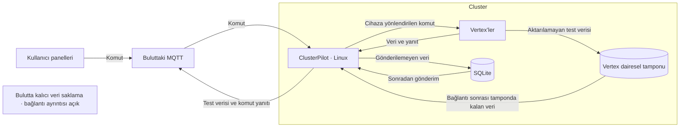

# Mimari Çalışma Notları

**Son Güncelleme:** 2026-09-18

## Kullanıcının tanımladığı genel yapı

**Kaynak:** 2026-09-18 tarihli görüşme. Aşağıdaki bilgiler kullanıcı anlatımıdır; genel mimarinin tamamı koddan doğrulanmadı. Vertex CAN/ISO-TP mesajları ayrıca incelendi; [mevcut mesaj envanteri](vertex-message-inventory.md). [ADR-0003](../07-decisions/ADR-0003-system-overview.md).

Tronloop, pilleri belirli test senaryolarına göre şarj/deşarj eden ve test verilerini bulutta saklayan bir pil test sistemidir. Sisteme Cluster'lar bağlanır; her Cluster içinde **Vertex** adlı test birimleri bulunur. **ClusterPilot**, Vertex'lerle bulut arasındaki veri ve komut akışını yöneten Linux sunucusudur.

| Bileşen | Kullanıcının belirttiği sorumluluk |
|---|---|
| Vertex | Cluster içindeki pil test birimi; senaryoyu ClusterPilot’a sürekli ihtiyaç duymadan yürütür |
| ClusterPilot | Vertex verilerini alma, buluttaki MQTT'ye gönderme, komutları doğru cihaza iletme ve yanıtları MQTT'ye gönderme |
| Yerel SQLite | Buluta gönderilemeyen verileri daha sonra gönderilmek üzere biriktirme |
| Buluttaki MQTT | Verilerin, panel kaynaklı komutların ve cihaz yanıtlarının mesajlaşma noktası |
| Kullanıcı panelleri | MQTT üzerinden cihazlara yönlendirilen komutları başlatma |
| Bulut veri saklama | Test verilerini kalıcı saklama; tüketici servis ve veritabanı seçimi bu görüşmede belirtilmedi |

Diyagram mantıksal akışı gösterir. Panelin MQTT'ye hangi ara servis üzerinden eriştiği, bulut depolama hattı ve bir Cluster'daki ClusterPilot sayısı henüz belirlenmedi. SQLite'ta komut yanıtlarının da saklanıp saklanmadığı ayrıca netleştirilecek.

## Bağımsız test yürütme

[ADR-0004](../07-decisions/ADR-0004-autonomous-vertex.md) uyarınca senaryo adımları Vertex firmware’i tarafından yürütülür; ClusterPilot’tan sürekli adım komutu veya onayı beklenmez. ClusterPilot bağlantısının kesilmesi tek başına testi durdurmaz. [ADR-0006](../07-decisions/ADR-0006-vertex-ring-buffer.md) uyarınca Vertex kısa kesintiler için sınırlı dairesel tampon kullanır. Sürekli bağlantı normal çalışma varsayımıdır. Tampon dolduğunda en eski kayıtların üzerine yazılır; test ve kayıt sürer. Bağlantı düzeldiğinde tamponda kalan bekleyen veriler aktarılır; kayıpsız saklama garantisi yoktur. Depolama ortamı, kapasite ve güç kesintisi sonrası davranış henüz seçilmedi.

## Zaman kaynağı ve ölçüm sırası

[ADR-0007](../07-decisions/ADR-0007-measurement-time-sequence.md): Vertex ölçümleri milisaniye çözünürlüğünde ölçüm zamanı ve sıra numarasıyla kaydedecek. STM32 RTC aktif çalışır; Linux üzerinde çalışan ClusterPilot periyodik mesajlarla saati eşitler. Mevcut RTC kodu Unix saniyelerini kullanır. Hedef milisaniye çözünürlüğü için mevcut kodun uyarlanması gerekiyor; eşitleme aralığı henüz seçilmedi. Sıra numarası artan bir kayıt ayırt edicisidir; test değişiminde sıfırlama şartı yoktur. Sayacın genişliği, yeniden başlama ve taşma davranışları henüz seçilmedi.

## Önceki mimari belgesinin durumu

[Önceki mimari belgesi](architecture.md) tarihsel referanstır. Buradaki veritabanı, donanım ve senkronizasyon ayrıntıları güncel kullanıcı anlatımıyla veya kodla doğrulanmadan güncel mimari kararı sayılmaz.

## Kaynak kapsamı

Kullanıcının 2026-09-18 tarihli açıklamasına göre `tronloop-defteri-kebir` kararların ve dokümantasyonun ana merkezidir. Diğer klasörler kod ve tasarım kaynaklarıdır. Adı `__` ile biten klasörler geçersizdir ve güncel mimari için kaynak alınmaz. Dayanak: [ADR-0002](../07-decisions/ADR-0002-documentation-scope.md).

### Güncel inceleme kapsamındaki klasörler

Aşağıdaki bileşenlerin ayrıntılı sorumlulukları ve aralarındaki bağlantılar henüz koddan doğrulanmadı.

- `tronloop-vertex-firmware`
- `tronloop-clusterpilot-engine`
- `Tronloop.UIMqttGateway`
- `tronloop-platform-panel`
- `tronloop.pcbdesigns`

### Geçersiz klasörler

- `tronloop-tester-firmware__`
- `tronloop-clusterpilot-can-processor__`
- `tronloop-node-orchestrator__`

Bu klasörler yalnızca kullanıcı açıkça tarihsel inceleme isterse değerlendirilir.

## Her mimari konu için kayıt biçimi

1. Amaç ve çözülen problem.
2. Bileşenler ve sorumluluk sınırları.
3. Veri ve komut akışları; ilgili haberleşme kayıtları.
4. Durumun ve verinin hangi bileşende tutulduğu.
5. Hata, yeniden başlatma ve toparlanma davranışı.
6. Alternatifler, gerekçeler ve ilgili karar kayıtları.
7. Açık sorular, kaynaklar ve doğrulama tarihi.

Haberleşme sözleşmeleri netleştikçe ayrıntılı sıralama diyagramları eklenecek.

