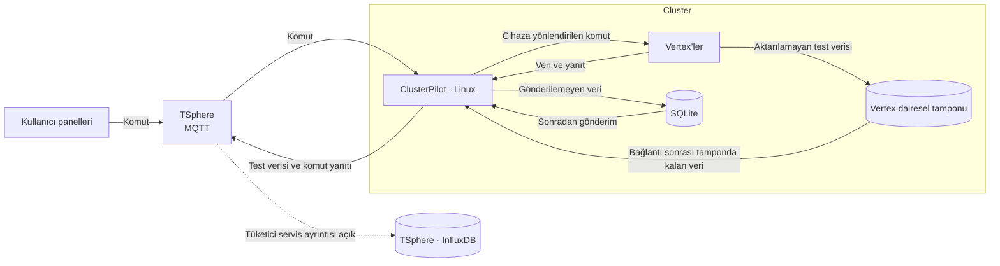

# Mimari Çalışma Notları

**Son Güncelleme:** 2026-09-18

## Genel yapı

Burada kurmak istediğimiz sistemi anlatıyoruz. 2026-09-18’de Vertex’in CAN/ISO-TP koduna baktık; diğer bileşenlerin tamamını henüz kontrol etmedik. [Kodda bulunan mesajlar](vertex-message-inventory.md) ve [genel yapı kararı](../07-decisions/ADR-0003-system-overview.md) ayrı sayfalarda.

Tronloop’ta pilleri senaryoya göre şarj ve deşarj ediyoruz. Pili test eden birim **Vertex**. Bunları Cluster içinde topluyoruz; **ClusterPilot** da Vertex’lerle bulut arasındaki iletişimi yönetiyor.

| Bileşen | Sorumluluk |
|---|---|
| Vertex | Cluster içindeki pil test birimi; senaryoyu ClusterPilot’a sürekli ihtiyaç duymadan yürütür |
| ClusterPilot | Vertex verilerini alma, TSphere üzerindeki MQTT'ye gönderme, komutları doğru cihaza iletme ve yanıtları MQTT'ye gönderme |
| Yerel SQLite | Buluta gönderilemeyen verileri daha sonra gönderilmek üzere biriktirme |
| TSphere (MQTT hizmeti) | Verilerin, panel kaynaklı komutların ve cihaz yanıtlarının mesajlaşma noktası |
| Kullanıcı panelleri | MQTT üzerinden cihazlara yönlendirilen komutları başlatma |
| Bulut veri saklama | Zaman serileri için InfluxDB seçildi; sürüm ve tüketici servis henüz açık. [Kayıt taslağı](tsphere-timeseries.md) |

Diyagramda verinin gittiği yolu görüyoruz. Panelin MQTT’ye nasıl bağlanacağı, bulutta veriyi hangi servisin saklayacağı ve iki BeagleBone’un devralma düzeni hâlâ açık. Komut yanıtlarını da SQLite’ta tutacak mıyız, onu ayrıca belirleyeceğiz.

## Bağımsız test yürütme

Testi Vertex kendi çalıştıracak; her adımda ClusterPilot’tan komut beklemeyecek. Bağlantı kesilmesi tek başına testi durdurmayacak. [Bağımsız çalışma kararı](../07-decisions/ADR-0004-autonomous-vertex.md).

Bağlantının normalde açık olduğunu varsayıyoruz. Kısa kesintiler için [ring buffer](../07-decisions/ADR-0006-vertex-ring-buffer.md) kullanacağız. Dolunca eski kayıtların üzerine yazılacak; bağlantı gelince elde kalan veriler gönderilecek. Tampon henüz kodda yok. Bellek türü, kapasitesi ve güç kesintisinde ne olacağı da açık.

## Zaman kaynağı ve ölçüm sırası

Zaman ve artan sıra numarası kullanmayı seçtik; [ADR-0007](../07-decisions/ADR-0007-measurement-time-sequence.md). Zaman artık telemetride `uint64_t` Unix ms olarak var. [Son düzenlemeyle](../07-decisions/ADR-0012-payload-time.md) RTC’yi payload oluştururken okuyoruz; sensörün ölçüm anını ayrıca saklamıyoruz.

ClusterPilot saati Linux zamanıyla belli aralıklarla eşitleyecek. Bu aralığı henüz seçmedik. Sıra numarası da henüz kodda yok; test değişince sıfırlanması gerekmiyor ama genişliğini, taşmasını ve yeniden başlama davranışını belirleyeceğiz.

## İki BeagleBone ile yedeklilik

ClusterPilot’u iki BeagleBone ile yedeklemek istiyoruz. Aktif/yedek roller, CAN gönderme yetkisi, devralma ve SQLite kuyruğunun durumu için [bir taslak hazırladık](clusterpilot-failover.md). Uygulama yöntemi henüz seçilmedi.

## Ana mimari sayfası

[Mimari sayfası](architecture.md) güncel yapıyı bir arada anlatıyor. Eski veritabanı ve eşitleme planı [arşivde](architecture-archive.md); burası kaynak kapsamı ve çalışma notları için.

## Kaynak kapsamı

`tronloop-defteri-kebir` kararların ve dokümantasyonun ana merkezidir. Diğer klasörler kod ve tasarım kaynaklarıdır. Adı `__` ile biten klasörler geçersizdir ve güncel mimari için kaynak alınmaz. Dayanak: [ADR-0002](../07-decisions/ADR-0002-documentation-scope.md).

### Güncel inceleme kapsamındaki klasörler

Aşağıdaki bileşenlerin ayrıntılı sorumlulukları ve aralarındaki bağlantılar henüz koddan doğrulanmadı.

- `tronloop-vertex-firmware`
- `tronloop-clusterpilot-engine`
- `Tronloop.UIMqttGateway`
- `tronloop-platform-panel`
- `tronloop.pcbdesigns`

### Geçersiz klasörler

- `tronloop-tester-firmware__`
- `tronloop-clusterpilot-can-processor__`
- `tronloop-node-orchestrator__`

Bu klasörler yalnızca özellikle istenen tarihsel karşılaştırmalarda incelenir.

## Yeni bir konu eklerken

1. Amaç ve çözülen problem.
2. Bileşenler ve sorumluluk sınırları.
3. Veri ve komut akışları; ilgili haberleşme kayıtları.
4. Durumun ve verinin hangi bileşende tutulduğu.
5. Hata, yeniden başlatma ve toparlanma davranışı.
6. Alternatifler, gerekçeler ve ilgili karar kayıtları.
7. Açık sorular, kaynaklar ve doğrulama tarihi.

Mesajlar netleştikçe akış diyagramlarını da tamamlayacağız.
