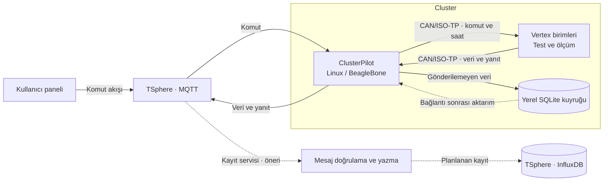

# Yazılım Mimarisi

Tronloop’ta pilleri belirlediğimiz senaryolara göre şarj ve deşarj ediyor, test verilerini bulutta tutuyoruz. Pili test eden birim **Vertex**. Vertex’leri **Cluster** içinde topluyoruz. **ClusterPilot**, bu birimlerle bulut sunucumuz **TSphere** arasındaki iletişimi yönetiyor.

Burada sistemin bugünkü tasarımını anlatıyoruz. Mesajların firmware tarafı hazır; ring buffer, alıcı uyarlaması ve failover gibi kalan işleri aşağıda ayrıca belirttik.

## Genel yapı

```mermaid
flowchart LR
    PANEL["Kullanıcı paneli"] -->|Komut akışı| MQTT["TSphere · MQTT"]
    subgraph CLUSTER["Cluster"]
        V["Vertex birimleri<br/>Test ve ölçüm"]
        CP["ClusterPilot<br/>Linux / BeagleBone"]
        SQL[("Yerel SQLite kuyruğu")]
        V -->|"CAN/ISO-TP · veri ve yanıt"| CP
        CP -->|"CAN/ISO-TP · komut ve saat"| V
        CP -->|Gönderilemeyen veri| SQL
        SQL -.->|Bağlantı sonrası aktarım| CP
    end
    CP -->|Veri ve yanıt| MQTT
    MQTT -->|Komut| CP
    MQTT -.->|"Kayıt servisi · öneri"| INGEST["Mesaj doğrulama ve yazma"]
    INGEST -.->|"Planlanan kayıt"| STORE[("TSphere · InfluxDB")]
```

Diyagram verinin izleyeceği yolu gösteriyor. Panelin MQTT’ye doğrudan mı bir servis üzerinden mi bağlanacağını, buluttaki kayıt servisini ve yanıtın panele dönüş yolunu henüz tamamlamadık. Kesikli bağlantılar bu bekleyen işleri gösteriyor.

| Bileşen | Ne yapıyor? |
|---|---|
| **Vertex** | Senaryoyu çalıştırıyor, pilin şarj/deşarjını ve ölçümlerini yönetiyor. Testi sürdürmek için ClusterPilot’tan adım adım komut beklemiyor. |
| **Cluster** | Vertex’leri ve ortak fiziksel altyapıyı bir araya getiriyor. Ayrı bir yazılım servisi değil. |
| **ClusterPilot** | CAN verisini alıyor, TSphere’e iletiyor; panel komutlarını doğru Vertex’e yönlendiriyor. |
| **SQLite** | ClusterPilot’un buluta gönderemediği kayıtları yerelde tutuyor. |
| **TSphere** | Bulut tarafı. MQTT haberleşmesi burada; zaman serileri için InfluxDB seçildi. Kayıt servisi ve InfluxDB sürümü henüz belirlenmedi. |
| **Panel** | Testi izlemek ve komut vermek için kullandığımız arayüz. |

## Testi Vertex yürütüyor

Senaryoyu Vertex’e verdikten sonra adımları firmware kendi yönetecek. ClusterPilot bağlantısı kesildi diye test durmayacak. Cihaz korumaları ve senaryonun durdurma koşulları yine geçerli; bağımsız çalışma bunları kaldırmıyor.

Bu ayrım sayesinde sunucuyu yeniden başlatırken veya ileride yedek BeagleBone’a geçerken testi baştan başlatmamız gerekmeyecek. Senaryo aktarımı, başlatma/durdurma komutları ve yeniden başlama sonrası devam davranışını henüz bütünüyle tamamlamadık. [Bağımsız test kararı](../07-decisions/ADR-0004-autonomous-vertex.md).

## Ölçüm ve komut akışı

Vertex, kayıtları **CAN/ISO-TP** üzerinden ClusterPilot’a gönderiyor. ClusterPilot veriyi **MQTT** üzerinden TSphere’e taşıyor. Buluta gönderemediği kayıtları SQLite’ta bekletip bağlantı gelince aktarmasını istiyoruz.

Komut ters yönde ilerliyor: **panel → TSphere/MQTT → ClusterPilot → Vertex**. Cihazın yanıtı da ClusterPilot üzerinden geri dönecek. Komut kimliği, yanıt kodları, zaman aşımı ve tekrar gelen komutun davranışı henüz tamamlanmadı. Firmware’deki mevcut komut ayrıştırıcısının birçok işlemi şimdilik yalnızca log yazıyor.

MQTT’ye teslim etmekle bulut veritabanına kaydetmek aynı şey değil. Kaydın ne zaman tamamlanmış sayılacağını ve SQLite’tan ne zaman silineceğini de netleştireceğiz. [Mesajlaşmanın ayrıntıları](communication-notes.md).

## TSphere’de zaman serileri

MQTT’den gelen ölçümleri **InfluxDB**’ye yazacağız. Araya mesajları doğrulayan ve toplu yazan küçük bir servis koymak şu anki öneri. Telemetri ve genel durumu ayrı serilerde tutmayı, Cluster/Vertex kimlikleriyle sorgulamayı planlıyoruz; ayrıntılı şema henüz kesinleşmedi.

Telemetride Vertex’in gönderdiği zamanı korumalıyız. Genel durum paketinde zaman yok; ClusterPilot’un ilk alım zamanını MQTT’ye ve yeniden gönderim kuyruğuna taşımasını öneriyoruz. Bağlantı sonrası gelen eski veriye buluta varış zamanını vermek grafiği kaydırır. Sıcaklıklar genel durumdan gelecek; ayrı sıcaklık mesajı yok.

InfluxDB kurulumu henüz yapılmadı. Sürüm, saklama süresi ve yazma onayı açık. [Kayıt akışı ve şema önerisi](tsphere-timeseries.md) · [InfluxDB kararı](../07-decisions/ADR-0016-tsphere-influxdb.md).

## Vertex’in gönderdiği mesajlar

| Mesaj | Tür | Boyut | Ne zaman? | İçerik |
|---|---|---|---|---|
| `VertexTelemetryPayload` | `0x01` | **13 bayt** | Yalnız RUNNING sırasında, hedef 100 ms | Gerilim, akım, Unix ms zamanı |
| `HeartbeatPayload` | `0x02` | Mevcut ARM derlemesinde 2 bayt | Hedef 500 ms | Context içindeki oynatıcı durumu |
| `VertexStatusPayload` | `0x03` | **11 bayt** | Test durumundan bağımsız, hedef 3 saniye | Gerilim, akım, oynatıcı durumu, charger modu, pil ve ortam sıcaklığı |

**Ayrı sıcaklık mesajı yok.** Sıcaklıklar yalnız genel durumda, ayrı `int16_t` alanlarında **°C × 10** olarak gidiyor. −32768 ölçüm yok demek. Hızlı telemetride sıcaklık taşımıyoruz.

Türü mesajın tür alanından okuyoruz; uzunluk yalnızca o türün şemasını kontrol ediyor. Telemetri ve genel durum, birer Flow Control ile birlikte **2 veri + 1 kontrol çerçevesi** kullanıyor. Heartbeat tek çerçeveye sığıyor. Heartbeat’in boyutu C enum boyutuna bağlı; onu taşınabilir sabit boyutlu bir şema gibi varsaymıyoruz.

Bu süreler gönderim hedefi. ISO-TP meşgulse hızlı telemetri ve heartbeat o tur atlanabiliyor. Genel durum boşalmasını bekliyor ve öncelikli deneniyor. Sıcaklık okumaları henüz bağlı değil; gerilim güncellemesi de yorum satırında. Genel durum oynatıcıyı doğrudan okurken heartbeat context’ten alıyor; bu iki kaynağın eşitlenmesi açık bir iş.

[Telemetri alanları](vertex-telemetry-message.md) · [Genel durum alanları](general-status-message.md) · [Kodda bulunan mesajlar](vertex-message-inventory.md)

## Bağlantı kesilince ne olacak?

İki ayrı kesintiyi ayrı ele alıyoruz:

| Kesinti | Planlanan davranış | Bugünkü durum |
|---|---|---|
| Vertex → ClusterPilot | Test devam edecek. Kısa kesintide kayıtlar Vertex ring buffer’ında bekleyecek. | Ring buffer henüz firmware’de yok. |
| ClusterPilot → TSphere | Gönderilemeyen veriler yerel SQLite’a yazılacak, bağlantı gelince aktarılacak. | SQLite’a kaydetme yolu var; yeni paketlerin alıcı uyarlaması ve kuyruğun uçtan uca yeniden aktarımı tamamlanmalı. |

Vertex tamponunu kayıpsız arşiv olarak düşünmüyoruz. Dolunca en eski kaydın üzerine yazılacak. Bağlantı gelince tamponda kalan veriler gönderilecek. Kapasiteyi, kullanılacak belleği ve güç kesilince ne olacağını daha belirleyeceğiz. [Ring buffer kararı](../07-decisions/ADR-0006-vertex-ring-buffer.md).

## Saat ve kayıt sırası

STM32’de RTC var. ClusterPilot, Linux zamanını belli aralıklarla göndererek Vertex’in saatini eşitleyecek. Mevcut saat ayarlama komutu saniye cinsinden; periyodik eşitleme aralığı henüz belli değil.

Telemetrideki `measurement_time_ms`, payload oluşturulurken **`TL_RTC_GetMs()`** ile alınıyor. `uint64_t` Unix milisaniye olduğu için Linux tarafında tarihe çevrilebiliyor. Bu değer sensörün tam okunduğu anı değil, paketin oluşturulduğu anı gösteriyor. RTC’nin mevcut adımı yaklaşık 3,9 ms. Açılışta sabit tarih atanması hâlâ düzeltilmesi gereken bir nokta.

Kayıtları ayırt etmek için artan bir sıra numarası da istiyoruz; henüz pakette yok. Test değişince sıfırlanması gerekmiyor. Sayaç genişliği, taşma ve yeniden başlama davranışını ayrıca belirleyeceğiz. [Zaman ve sıra kararı](../07-decisions/ADR-0007-measurement-time-sequence.md).

## İki BeagleBone ile yedeklilik

ClusterPilot’u iki BeagleBone ile yedeklemek istiyoruz. Şu anki öneri, birinin aktif, diğerinin hazır yedek olması. Uygulama yöntemi henüz seçilmedi; otomatik devralma kodu da hazır değil.

Devralırken iki kartın aynı anda CAN’e komut veya Flow Control göndermemesi gerekiyor. Yalnız heartbeat kaybına bakmak yeterli değil; eski aktifi gerçekten devre dışı bırakan bir yöntem lazım. Corosync/Pacemaker ve bağımsız güç kesme seçeneklerini değerlendiriyoruz. SQLite kuyruğunun diğer karta geçmesi de ayrı bir iş; iki kart koymak veriyi kendiliğinden yedeklemiyor.

[Yedeklilik taslağı](clusterpilot-failover.md).

## Şu an nerede duruyoruz?

Vertex firmware’inde 13 bayt telemetri ve 11 bayt genel durum hazır. Derleme ve bilgisayardaki paket kontrolleri geçti; kartta uçtan uca test yapılmadı.

ClusterPilot tarafında C#/.NET, Linux ISO-TP socket’leri, MQTT ve SQLite kodu var. Ancak alıcı hâlâ eski `FastTelemetryPayload` ve uzunlukla ayrıştırma yolunu kullanıyor; yeni firmware paketlerini doğru işlemek için güncellenmesi gerekiyor. Sistemin tamamı hazır demiyoruz.

16 Vertex’in hepsi 100 ms’de bir telemetri gönderirken, heartbeat ve genel durum dahil 500 kbit/s CAN yükünü yaklaşık **%11,7–14,3** hesaplıyoruz. Bu ölçülmüş performans değil; komutlar, hatalar ve tampon boşaltma trafiği hariç. Cihaz başına CAN adresleri ve RX filtrelemesi de tamamlanmalı. [Hesap](communication-notes.md).

## Eski plandan kalanlar

PostgreSQL, dakikada bir bulut eşitleme, RAID1 ve örnek Docker Compose düzeni ilk plandaki seçeneklerdi. Bunları bugünkü mimarinin kesin parçaları gibi göstermiyoruz. InfluxDB ise ADR-0016 ile zaman serileri için seçildi; eski plandaki kurulum ayrıntıları bu karara dahil değil. Geçmişi kaybetmemek için [ilk tasarım sayfasına](architecture-archive.md) taşıdık.

**Kaynaklar:** 2026-09-18 proje kararları; `tronloop-vertex-firmware/Core/Inc/tl_dispatcher.h`, `Core/Src/tl_dispatcher.c`, `Core/Src/tl_rtc.c`; `tronloop-clusterpilot-engine/CanIsoTpListener.cs`, `TelemetryPublisher.cs`, `SqliteTelemetryStore.cs`. Diğer bileşenleri uçtan uca henüz doğrulamadık.

[Karar defteri](../01-project-general/decision-hub.md) · [Çalışma notları](architecture-notes.md) · [Karar kayıtları](../07-decisions/README.md)
