*🔋 TRONLOOP — Batarya Kapasite Kayıp İzleme Sistemi*

---
# Yazılım Mimarisi

Node firmware'i + ana ünite koordinasyon yazılımı + analiz araçlarından oluşan üç katmanlı yapı. Node'lar ile ana ünite CAN bus üzerinden haberleşir. Ana ünite topladığı veriyi her 1 dakikada bir cloud'a senkronize eder.

---

## Katmanlar

```mermaid
flowchart TD
    subgraph NODE["Node (STM32L476)"]
        FW["Firmware<br/>Şarj/Deşarj + Ölçüm + İklim"]
    end

    subgraph ANA["Ana Ünite (BeagleBone)"]
        CAN["CAN Bus Alıcı"]
        LOCAL["Yerel Depolama<br/>mdadm RAID1"]
        SYNC["Cloud Sync Daemon<br/>her 1 dakika"]
    end

    subgraph CLOUD["Cloud"]
        INFLUX["InfluxDB<br/>Ölçüm Verisi<br/>(Zaman Serisi)"]
        PG["PostgreSQL<br/>Konfigürasyon<br/>Metadata · Deneyler"]
    end

    FW -->|CAN bus| CAN
    CAN --> LOCAL
    LOCAL --> SYNC
    SYNC -->|"her 1 dk"| INFLUX
    SYNC -->|"değişiklikte"| PG
```



---

## Veritabanı Mimarisi

### InfluxDB — Ölçüm Verisi (Zaman Serisi)

Node'lardan gelen tüm elektriksel ve iklimsel ölçümler burada saklanır. Zaman serisi veritabanı olduğundan yüksek frekanslı yazma ve trend sorguları için optimize edilmiştir.

| Parametre | Değer |
|-----------|-------|
| Tür | Zaman serisi veritabanı (TSDB) |
| Dev ortamı | Docker — `docker run influxdb:2` |
| Prod ortamı | InfluxDB Cloud (AWS üzerinde, ücretsiz tier) |
| Retention | Ücretsiz tier: 30 gün · Ücretli: sınırsız |
| Client | Python `influxdb-client` |
| Sync sıklığı | Her 1 dakika |

**Ölçüm yapısı (measurement: `battery_data`):**

| Field | Tip | Açıklama |
|-------|-----|----------|
| `voltage` | float | Anlık voltaj (V) |
| `current` | float | Anlık akım (A) |
| `capacity` | float | Kalan kapasite (mAh) |
| `soh` | float | State of Health (%) |
| `temp_surface` | float | Pil yüzey sıcaklığı °C (NTC) |
| `temp_ambient` | float | Ortam sıcaklığı °C (TMP117) |
| `cycle_count` | int | Döngü sayısı |

**Tag'lar:**

| Tag | Açıklama |
|-----|----------|
| `node_id` | CAN ID (1–50) |
| `experiment_id` | Hangi deneye ait |
| `cell_type` | Batarya kimyası (LFP, NMC vb.) |

---

### PostgreSQL — Konfigürasyon ve Metadata

Deney tanımları, node konfigürasyonları, batarya bilgileri ve sistem ayarları burada saklanır.

| Parametre | Değer |
|-----------|-------|
| Tür | İlişkisel veritabanı |
| Dev ortamı | Docker — `docker run postgres:15` |
| Prod ortamı | Amazon RDS PostgreSQL (fully managed) |
| Client | Python `psycopg2` / `SQLAlchemy` |
| Sync | Konfigürasyon değişikliklerinde |

**Temel tablolar:**

| Tablo | İçerik |
|-------|--------|
| `experiments` | Deney adı, başlangıç/bitiş, hedef parametreler |
| `nodes` | Node ID, seri no, kurulum tarihi |
| `cells` | Batarya bilgileri (kapasite, kimya, yaş) |
| `test_profiles` | Şarj/deşarj protokol tanımları |
| `system_config` | Ana ünite ve node konfigürasyonları |

---

## Yerel Depolama

Ana ünite (BeagleBone) internet bağlantısı kesildiğinde veriyi yerel olarak tamponlar; bağlantı geri gelince cloud'a toplu gönderir. Yerel depolama iki USB SSD üzerinde **mdadm RAID1** ile yedeklenir.

| Bileşen | Açıklama |
|---------|----------|
| Depolama | 2× USB SSD, mdadm RAID1 |
| Format | Ham ölçüm: CSV · Offline buffer: SQLite |
| Offline buffer | Bağlantı yokken SQLite'a yaz, bağlantı gelince InfluxDB'ye flush |
| Yedek | Haftalık rsync → harici sürücü veya NAS |

---

## Docker Compose (Dev Ortamı)

Yerel geliştirme ortamında InfluxDB ve PostgreSQL tek komutla ayağa kalkar:

```yaml
services:
  influxdb:
    image: influxdb:2
    ports:
      - "8086:8086"
    volumes:
      - influxdb_data:/var/lib/influxdb2

  postgres:
    image: postgres:15
    environment:
      POSTGRES_DB: tronloop
      POSTGRES_USER: tronloop
      POSTGRES_PASSWORD: tronloop_dev
    ports:
      - "5432:5432"
    volumes:
      - postgres_data:/var/lib/postgresql/data

volumes:
  influxdb_data:
  postgres_data:
```

`docker compose up -d` ile her iki servis ayağa kalkar. Prod'a geçişte sadece connection string değişir.

---

**İlgili Dosyalar:** [Veri Toplama](data-collection.md) · [Analiz](analysis.md) · [Ana Ünite](../02-hardware/main-unit.md)
