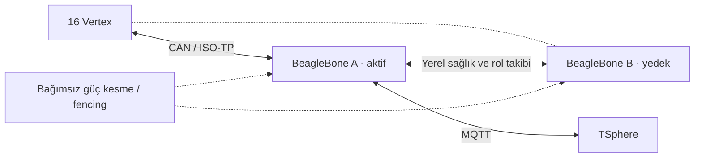

# İki BeagleBone ile ClusterPilot yedekliliği

ClusterPilot’u iki BeagleBone ile yedeklemek istiyoruz. Biri arızalanınca diğeri veri toplamayı ve komut iletmeyi devralacak. İki kart hedefi belli; aşağıdaki aktif/yedek düzeni ve uygulama ayrıntıları henüz öneri.

## Başlangıç için nasıl kurabiliriz?

Bir kart aktif, diğeri hazır bekleyen yedek olsun. İkisi de aynı Vertex CAN hattına bağlı olabilir, ama CAN’e komut ve ISO-TP Flow Control gönderen yalnızca aktif kart olsun. İlk sürümde yedekte normal ISO-TP alıcı servisini açmayabiliriz; bu, rol yönetimini basitleştirir.

Bu çizim önerilen normal durumu gösteriyor. Roller değişince CAN ve MQTT işini B devralacak. Her kartın ayrı CAN transceiver’ı gerekir; dahili CAN kontrolcüsü fiziksel hat sürücüsünün yerini tutmuyor. Donanım seçimi ve bağlantı ayrıntıları henüz yapılmadı.

## Sadece heartbeat yeterli değil

A’dan haber gelmemesi, A’nın kapandığı anlamına gelmeyebilir. Aradaki ağ kopmuş ama A hâlâ Vertex’lere komut gönderiyor olabilir. B de kendini aktif yaparsa iki kart birden yönetmeye başlar; split-brain dediğimiz durum bu.

Bu yüzden B devralmadan önce A’nın artık yönetemediğinden emin olmalı. İlk öneri, kartın kendisi çalışmasa da dışarıdan gücünü kesebilen bir düzen kullanmak. Bunun adı fencing. Yalnız SSH ile servisi durdurmak yeterli değil; kilitlenmiş kart yanıt vermeyebilir. Fencing kontrol yolu ve beslemesi, kapatılacak kartın çalışmasına bağımlı olmamalı. [Pacemaker’ın açıklaması](https://clusterlabs.org/projects/pacemaker/doc/3.0/Pacemaker_Explained/html/fencing.html).

Yazılımda Corosync + Pacemaker değerlendirilebilir. Rol seçimini, servis izlemeyi ve fencing sırasını bunlara bırakabiliriz; BeagleBone’daki dağıtım, kaynak tüketimi ve fence cihazı/agent uyumu ayrıca denenmeli. İki kartın birbirini aynı anda kapatmasını önleyen öncelik/gecikme ve gerekirse yerel üçüncü oy düzeni de tasarımın parçası. Üçüncü oy tek başına eski aktifi fiziksel olarak susturmanın yerini tutmuyor. Belirsizlikte iki yöneticiyi birden çalıştırmak yerine devralmayı bekletiyoruz.

Alternatif, küçük ve bağımsız bir denetleyicinin CAN gönderme iznini tek karta vermesi. Burada yalnızca GPIO ile “aktifim” demek yetmez; donanım kilidi iki göndericiyi aynı anda açmamalı. Ayrıca MQTT’deki komut yetkisini de yönetmek gerekir. İlk kurulum için güç keserek fencing daha kolay sınanabilir bir seçenek; donanım kilidi henüz seçilmiş değil.

Yerel devralmayı yalnızca TSphere erişimine bağlamayalım. İnternet kesilince aktif kart SQLite’a yazmaya devam edebilmeli; sırf buluta ulaşamıyor diye rol değiştirmemeli.

## CAN tarafındaki önemli ayrıntı

13 bayt telemetri 2 veri çerçevesiyle geliyor ve bir alıcının Flow Control göndermesini bekliyor. İki normal ISO-TP alıcısını aynı adreslerle açarsak ikisi de yanıt verebilir. Yedekte yalnız uygulamanın komut göndermesini kapatmak bu yüzden yeterli değil.

Yedeğin de ölçümleri izlemesini istersek Linux’ta `CAN_ISOTP_LISTEN_MODE` var; Flow Control göndermeden dinliyor. Bu seçenek fencing sağlamaz, CAN kontrolcüsünü fiziksel olarak sessiz moda da almaz. Pasif dinleme ve yeniden birleştirmeyi kullandığımız kernel üzerinde test etmemiz gerekir. Aktif alıcı sustuğunda yedek pasif kaldığı sürece yeni çok çerçeveli aktarımlar tamamlanamaz. [Linux ISO-TP belgesi](https://kernel.org/doc/html/latest/networking/iso15765-2.html).

Aktif rolü hangi kart alırsa alsın Vertex’e aynı mantıksal ClusterPilot CAN adreslerinden cevap verebilir. Bunun için eski aktif önce susturulmalı. Vertex adreslerini de cihaz başına ayırmamız gerekiyor; firmware’deki sabit `0x100` ve RX filtreleme sorunu hâlâ açık.

## Devralma sırası

1. Aktif servisin sağlığı bozulur veya kart erişilemez olur. Yalnız ping değil, uygulamanın ilerlemesi ve CAN durumu da izlenir.
2. Rol yönetimi A’yı kapatır veya gerekli erişimlerini keser; işlemin başarılı olduğunu doğrular.
3. B aktif rolü alır, CAN/ISO-TP ve komut işleme servisini açar.
4. Vertex’lerin durumunu sorgular. Testleri baştan başlatmaz; zaten cihaz üzerinde sürüyorlar.
5. Canlı veriyi toplamaya devam eder. Ring buffer uygulanınca, orada kalan bekleyen kayıtları da alır.
6. A geri gelince yedek kalır. Sırf geri geldi diye hemen bir kez daha rol değiştirmeyiz.

Birkaç saniyelik devralma süresi başlangıç hedefi olabilir; ölçülmüş bir süre değil. Algılama, fencing ve servis başlatma sürelerini birlikte ölçmeliyiz. Geçiş ortasındaki ISO-TP paketi kaybolabilir. Vertex ring buffer’ı henüz yazılmadığı için bugün kesintiyi verisiz atlatma garantimiz yok.

## Çalışmaya devam etmek ile veriyi korumak ayrı işler

A’nın SQLite kuyruğundaki veri kendiliğinden B’ye gelmez. İlk sürümde iki kartın kendi yerel SQLite’ı olabilir. A bozulunca B yeni verileri toplar; A’daki eski kuyruk ancak disk/veri erişilebilir olduğunda geri alınabilir. Disk tamamen kaybolursa o kayıtlar da kaybolabilir.

Eski kuyruğun da otomatik devralınmasını istiyorsak kayıtları diğer karta aktarma veya doğru biçimde yönetilen depolama replikasyonu ayrıca gerekir. Canlı SQLite dosyasını ortak ağ klasörüne koyup iki karttan yazmayı çözüm saymıyoruz. [SQLite’ın dosya kilitleme notları](https://www.sqlite.org/howtocorrupt.html).

Pasif CAN dinleyerek iki karta kayıt almak ek koruma sağlayabilir ama tam ve eşzamanlı bir kopya garantisi vermez. Kayıtları birleştirmek için Vertex kimliği, yeniden başlama/oturum kimliği ve sıra numarası gibi bir kayıt anahtarı tasarlamamız gerekiyor. Zaman damgası tek başına yeterli değil; sıra numarası da mevcut telemetride henüz yok.

Komutlarda da benzer bir sorun var: A komutu iletip yanıtı kaydetmeden düşebilir. B aynı komutu yeniden gönderdiğinde test ikinci kez başlamamalı. Komut kimliği, tekrar işleme kuralı ve Vertex’ten güncel durumu okuma akışını tamamlamadan körlemesine yeniden denemeyelim. MQTT Client ID çakışmasını rol kilidi olarak kullanmıyoruz; bulut bağlantısını da aktif rol yönetiyor.

## Denemeden bitmiş saymayacağımız durumlar

Aktif servisi durdurma, kartın gücünü kesme, yalnız kartlar arasındaki ağı ayırma, yalnız interneti kesme, CAN bağlantısını kaybetme, depolamayı doldurma ve eski kartın geri gelmesini ayrı ayrı deneyeceğiz. Aynı anda yalnız bir yöneticinin komut/Flow Control gönderdiğini ve testin yeniden başlamadığını kontrol edeceğiz.

İki kart ortak CAN hattını, switch’i veya güç kaynağını paylaşırsa bu ortak parçalar hâlâ arıza noktası. Fencing donanımı da buna dahil. İki BeagleBone koymak bütün sistemi tek başına yedeklemiyor.

## Şu an kodda

2026-09-18 incelemesinde `tronloop-clusterpilot-engine/CanIsoTpListener.cs` normal ISO-TP socket açıyor; standby dinleme seçeneği görülmedi. `Worker.cs` CAN alıcıları ve MQTT bağlantısını, `SqliteTelemetryStore.cs` yerel kuyruğu yönetiyor. Burada anlatılan failover düzeni uygulanmadı; bu çalışma kod değişikliği içermiyor.

[Mimari notlar](architecture-notes.md) · [CAN kapasite hesabı](communication-notes.md) · [Eski donanım planı](../02-hardware/main-unit.md)
