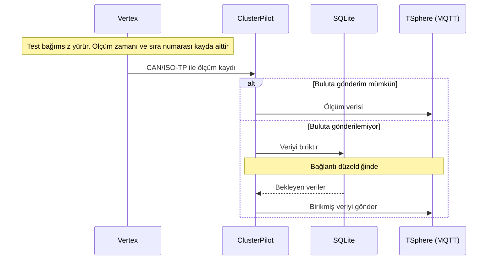
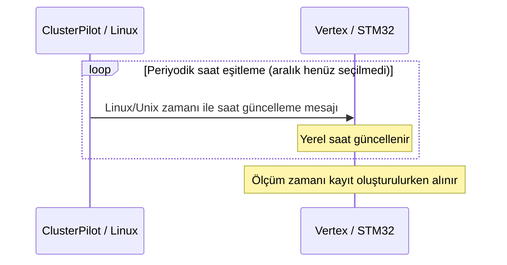
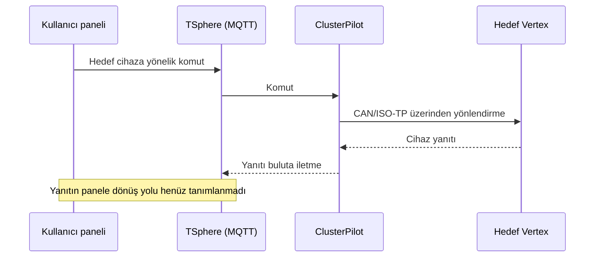

# Tronloop Mesajlaşma Protokolü — Çalışma Taslağı

**Son Güncelleme:** 2026-09-18

## Genel akış

Vertex’ten çıkan veri ClusterPilot üzerinden TSphere’e gidiyor. Komutlar da aynı yolun tersinden geliyor. Bu sayfada mesajların nasıl taşınacağını, bağlantı kesilince ne olacağını ve henüz tamamlamadığımız ayrıntıları bir arada tutuyoruz. “Öneri” yazan bölümler hâlâ fikir aşamasında; “kodda” dediğimiz yerler mevcut uygulama.

İsimleri sabit tutuyoruz: test grubu **Cluster**, Linux sunucusu **ClusterPilot**, pili test eden birim **Vertex**. `__` ile biten eski klasörleri kullanmıyoruz.

Dayanaklar: [Genel yapı](../07-decisions/ADR-0003-system-overview.md), [bağımsız test yürütme](../07-decisions/ADR-0004-autonomous-vertex.md), [dairesel tampon](../07-decisions/ADR-0006-vertex-ring-buffer.md), [zaman ve sıra numarası](../07-decisions/ADR-0007-measurement-time-sequence.md). Eski ADR-0005'in yerini ADR-0006 almıştır.

**TSphere**, bulut sunucusunun adıdır; MQTT bu sunucudaki haberleşme hizmetidir. [Adlandırma kararı](../07-decisions/ADR-0009-tsphere-name.md).

## 1. Haberleşme hatları

| Hat | Yön | Taşıma | Görev | Durum |
|---|---|---|---|---|
| COM-001 | Vertex → ClusterPilot | CAN/ISO-TP | Ölçüm verisi ve cihaz yanıtları | Kesinleşti; paket biçimleri açık |
| COM-002 | ClusterPilot → TSphere üzerindeki MQTT | MQTT | Ölçümleri ve cihaz yanıtlarını buluta iletme | Kesinleşti; konu ve içerik şeması açık |
| COM-003 | Kullanıcı paneli → TSphere üzerindeki MQTT | MQTT üzerinden mantıksal akış | Komut başlatma | Kesinleşti; doğrudan erişim/ara servis ayrıntısı açık |
| COM-004 | TSphere üzerindeki MQTT → ClusterPilot | MQTT | Hedef cihaza yönlendirilecek komutu alma | Kesinleşti; abonelik ve adresleme açık |
| COM-005 | ClusterPilot → Vertex | CAN/ISO-TP | Komut yönlendirme ve periyodik saat güncelleme | Kesinleşti; mesaj biçimi ve zamanlama açık |
| COM-006 | ClusterPilot ↔ SQLite | Yerel veritabanı | Buluta gönderilemeyen veriyi biriktirme ve yeniden gönderme | Kesinleşti; kayıt silme/onay koşulları açık |

Zaman serilerini TSphere’de InfluxDB’ye yazacağız; [kayıt akışı taslağı](tsphere-timeseries.md). Kaydı hangi servisin yazacağını ve yanıtın panele nasıl döneceğini daha belirleyeceğiz. MQTT’ye gönderdik diye veritabanına da yazıldı saymıyoruz. Bunun için ayrı bir onay gerekip gerekmediği açık.

## 1.1. Tür alanıyla ayrıştırma

Mesajın ne olduğunu **tür alanından** anlıyoruz. Uzunluk yalnızca o tür için yeterli veri gelip gelmediğini kontrol ediyor. Dolayısıyla iki farklı tür aynı uzunlukta olabilir. [ADR-0010](../07-decisions/ADR-0010-message-type-and-operation-mode.md) ile eski benzersiz uzunluk kuralını bıraktık.

Alıcı önce türü okuyabilecek kadar veri var mı diye bakacak. Sonra türü ve boyutu kontrol edip alanları açacak. Tanımadığı bir mesajı başka türe benzetmeye çalışmayacak. Alan boyutlarını ve sürümleri açıkça yazıyoruz; özellikle C enum boyutunu varsaymıyoruz.

## 2. Verinin izleyeceği yol

1. Vertex, test senaryosunu kendi üzerinde yürütür ve ölçümü üretir.
2. Kayda zaman eklenir. Güncel telemetride bu, payload oluşturma anıdır. Artan sıra numarası da eklenecek; henüz kodda yok.
3. Vertex kaydı CAN/ISO-TP üzerinden ClusterPilot'a aktarır. Kısa gönderim kesintileri dairesel tamponla karşılanır.
4. ClusterPilot aldığı veriyi TSphere üzerindeki MQTT'ye gönderir.
5. Buluta gönderemediği veriyi SQLite'ta biriktirir ve daha sonra gönderir.

Diyagram gitmek istediğimiz yolu gösteriyor. Ring buffer ve sıra numarası henüz yok. Teslim onayını, SQLite işlem sınırlarını ve kayıtları tek tek mi toplu mu göndereceğimizi de ayrıca belirleyeceğiz.

## 3. Ölçüm kaydının anlamı

Burada bir kayıtta neyi bilmek istediğimizi yazıyoruz. Güncel C alanları [telemetri sayfasında](vertex-telemetry-message.md); MQTT/JSON biçimi henüz belli değil.

| Bilgi | Anlamı | Karar durumu |
|---|---|---|
| Zaman | Unix milisaniye; güncel telemetride payload oluşturma anı | ADR-0012 ile güncellendi |
| Sıra numarası | Artmaya devam eden kayıt ayırt edicisi; test değişiminde sıfırlama şartı yok | Kesinleşti |
| Ölçüm değerleri | Gerilim, akım, pil ve ortam sıcaklığı | Telemetri biçimi belli; bazı sensör okumaları henüz yok |
| Kaynak Vertex/Cluster bilgisi | Kaydın hangi cihaza ait olduğunu belirleme | Adres/konu/paket içindeki temsil biçimi açık |
| Test kimliği | Ölçümü bir test çalıştırmasıyla ilişkilendirme | Alan olarak kullanımı ve üretimi henüz kararlaştırılmadı |

Tamponu eklediğimizde, bekleyen kaydı yeniden gönderirken içindeki zamanı değiştirmeyeceğiz. Sıra numarası sadece ayırt edici; bütün cihazlarda ve her yeniden başlatmada benzersiz değil. Kaç bayt olacağını, taşınca ve cihaz yeniden başlayınca ne yapacağını henüz seçmedik.

**Anlam örneği:** Sıra 105 numaralı kayıt tamponda kaldıysa, bağlantı sonrasında aynı ölçüm zamanı ve sıra bilgisiyle aktarılır. Uzun kesintide 106–120 üzerine yazılmışsa bu kayıtlar geri getirilemez. Bu örnek mesaj kodu, aktarım sırası veya boşluk bildirim mekanizması belirlemez.

## 4. Vertex dairesel tamponu

Bağlantının normalde açık kalacağını varsayıyoruz. Ring buffer kısa kesintiler için; her veriyi sonsuza kadar korumaya çalışmıyoruz.

| Durum | Davranış |
|---|---|
| Bağlantı açık | Ölçümler üretilir ve ClusterPilot'a aktarılır |
| Gönderim kesildi | Test ve kayıt devam eder; veriler sınırlı dairesel tamponda tutulur |
| Tampon doldu | Yeni kayıt en eski kaydın üzerine yazılır; eski kayıt gönderilmemiş olsa da korunmak zorunda değildir |
| Bağlantı düzeldi | Tamponda hâlâ bulunan, aktarılmayı bekleyen kayıtlar gönderilir |
| Kesinti tamponun kapsadığı süreden uzun | Üzerine yazılan eski veriler kaybolabilir; bu kabul edilen davranıştır |

Eski kayıt için onay beklerken tamponu durdurmayacağız. Teslim onayı veya tekrar gönderme eklesek bile yeni veri eski kaydın üzerine yazabilmeli.

**Açık:** Tampon kapasitesi ve bellek ortamı, kayıt sıklığı, aktarım konumunun ilerletilmesi, canlı/birikmiş veri önceliği, tekrarlar ve kayıp bildirimi. Güç kesintisinde tamponun korunacağına ilişkin karar yoktur.

## 5. Saat eşitleme

- STM32 üzerindeki RTC aktif çalışır.
- ClusterPilot, Linux/Unix zamanını **belirli aralıklarla mesajla** Vertex'e gönderir; Vertex saati güncellenir.
- Bağlantı kesilince Vertex kendi saatiyle test ve kayıt işlemine devam eder.
- Ölçüm kayıtlarının hedef çözünürlüğü milisaniyedir. Bu karar eşitlemenin 1 ms doğruluk sağlayacağına ilişkin garanti değildir.

**Kodda:** `TL_RTC_Set()` ve `TL_RTC_Get()` saniye cinsinden çalışıyor. Sonradan eklediğimiz `TL_RTC_GetMs()` milisaniye döndürüyor; payload oluştururken onu çağırıyoruz. `tl_can.c` içinde dört bayt little-endian zamanla RTC ayarlama var. Açılışta hâlâ sabit `1710255720UL` atanıyor. Linux’taki periyodik göndericiyi henüz doğrulamadık.

**Kalanlar:** Eşitleme aralığı, ilk eşitlemeden önce kayıtların durumu, saatin ileri/geri alınması ve yeni saat mesajının biçimi. Eski ham CAN komutunu aynen kullanacağımızı henüz söylemiyoruz.

## 6. Komut ve yanıt akışı

ClusterPilot komutu doğru Vertex’e iletecek. Testi adım adım uzaktan yönetmiyoruz; senaryoyu Vertex çalıştıracak. Senaryo aktarımı ve test kontrolü mesajlarını daha tanımlayacağız.

**Öneri — henüz karar değil:** Komutun alındığı, kabul/ret edildiği ve uygulandığı durumları ayırmak; komutla yanıtı eşleştiren bir kimlik kullanmak. Ölçüm sıra numarasının bu amaçla kullanılacağı kararlaştırılmadı.

**Açık:** Komut listesi, senaryo aktarımı, yanıt kodları, zaman aşımı, yeniden deneme, tekrarlanan komutlar, eski/gecikmiş komutlar, hedefe ulaşılamaması ve yetkilendirme. Cihaz yanıtlarının Vertex tamponuna veya ClusterPilot SQLite kuyruğuna dahil olduğu henüz kararlaştırılmadı.

## 7. Mesaj aileleri — öneri

Mesajları aşağıdaki gibi gruplamayı düşünüyoruz. Bunlar henüz seçilmiş tür kodları değil.

| Aile | Yön | Amaç |
|---|---|---|
| Ölçüm | Vertex → ClusterPilot → TSphere | Deney ölçümleri, ölçüm zamanı ve sıra bilgisi |
| Durum | Vertex → ClusterPilot → TSphere | Cihazın ve testin güncel durumu |
| Olay | Vertex → ClusterPilot → TSphere | Adım geçişi, test bitişi veya hata |
| Komut | Panel → MQTT → ClusterPilot → Vertex | İstenen işlemi cihaza iletme |
| Komut sonucu | Vertex → ClusterPilot → MQTT | İşlemin sonucunu bildirme |
| Saat eşitleme | ClusterPilot → Vertex | Linux zamanını Vertex'e iletme |

Ölçüm, komut/yanıt ve saat güncelleme **işlevleri** kesinleşmiştir; bunların ayrı mesaj türleri olarak kodlanması, ortak başlıkları ve durum/olay ayrımı henüz seçilmedi.

## 8. Mevcut firmware ile hedef tasarımın farkı

| Başlık | Mevcut kod gözlemi | Hedef / durum |
|---|---|---|
| Gönderilen mesajlar | `VertexTelemetryPayload` (`0x01`), `HeartbeatPayload` (`0x02`), `VertexStatusPayload` (`0x03`) | Tipler yeniden tasarıma açık |
| Hedef gönderim aralıkları | Telemetri 100 ms (RUNNING), heartbeat 500 ms, durum 3000 ms | Hesapta bunları kullanıyoruz; gerçek zamanlamayı kartta kontrol edeceğiz |
| Gelen komut başlığı | command, version, sequence, flags; her biri bir bayt, toplam dört bayt | Yeni başlık ve ölçüm sıra alanıyla ilişkisi açık |
| Komut uygulama/yanıt | İncelenen ayrıştırıcı komutları logluyor; cihaz işlemleri yorum satırında; ağ yanıtı üretmiyor | Komut yürütme ve yanıt biçimi tasarlanacak |
| Ölçüm zamanı | Telemetride uint64_t Unix ms, payload oluşturma zamanı; RTC doğrudan okunur | Uygulandı; mevcut adım yaklaşık 3,9 ms, Linux eşitleme ayrıntıları açık |
| Ölçüm sıra numarası | İncelenen periyodik paketlerde ölçüm sayacı yok | Artan ayırt edici eklenecek |
| Dairesel tampon | İstenen davranışın uygulanmış olduğu doğrulanmadı | ADR-0006 davranışı uygulanacak |

Kodun ayrıntıları [mesaj envanterinde](vertex-message-inventory.md). Genel durumun derlemesi ve bilgisayardaki paket kontrolleri geçti; kart testi daha yapılmadı.

`VertexTelemetryPayload` artık **13 bayt**: tür (1), gerilim (2), akım (2), Unix ms (8). Sıcaklıklar yalnız [genel durumda](general-status-message.md). Ayrı sıcaklık türü kaldırıldı. [Güncel telemetri](vertex-telemetry-message.md).

## 8.1. VertexStatusPayload — genel durum mesajı

Genel durum artık **11 bayt**, tür **0x03**, aralık **3000 ms**. Tür, gerilim, oynatıcı durumu, charger modu ve akımın sonuna pil/ortam sıcaklıklarını ekledik. İkisi de int16_t, °C × 10; −32768 ölçüm yok demek. Test durmuşken de gönderiliyor.

ISO-TP ilk çerçevede 6, devam çerçevesinde 5 bayt taşıyor. Bir Flow Control ile toplam üç CAN çerçevesi var. Eski 7 bayt alıcının güncellenmesi gerekiyor. [Alanlar ve örnek](general-status-message.md) · [ADR-0014](../07-decisions/ADR-0014-status-temperatures.md).

## 9. Tamamlanacak protokol ayrıntıları

| Konu | Henüz seçilmemiş ayrıntılar |
|---|---|
| Adresleme | Cluster/Vertex kimlik kapsamı, CAN ID eşlemesi ve ClusterPilot sayısı |
| İkili paket | Tür kodu–şema tablosu, türe göre `dataLength` doğrulaması, mesaj kodları, sürüm başlığı, alan boyutları, bayt sırası, tekil/toplu ölçüm |
| Ölçüm | Alan listesi, birimler, geçerlilik bilgisi ve kayıt sıklığı |
| Sayaç ve zaman | Sayaç boyutu/taşması/yeniden başlama; zaman kodlaması ve eşitleme aralığı |
| MQTT | Konular, içerik biçimi, QoS, retained kullanımı, oturum ve abonelik düzeni |
| Tampon ve kuyruk | Vertex kapasitesi/aktarım konumu; SQLite kapsamı, teslim ve silme koşulları |
| Komutlar | İşlem listesi, hedefleme, ilişkilendirme, hata kodları ve yeniden deneme |
| Bulut ve panel | Kalıcı depolama tüketicisi, panel bağlantısı ve yanıtın panele iletilmesi |

Bu ayrıntılar netleştikçe burayı ve ilgili karar kaydını birlikte güncelleyeceğiz.

## Önceki değerlendirme: Tek çerçeve hedefi

İlk değerlendirmede zaman ve sıra bilgisini korumak için telemetrinin birden fazla ISO-TP çerçevesiyle taşınması önerildi. O sırada 7 baytlık biçim kullanılıyordu. Sonrasında 17 baytlık biçime geçildi; aşağıdaki 19 baytlık yerleşim ise uygulanmamış bir alternatif olarak kaldı. O aşamadaki karar [ADR-0011](../07-decisions/ADR-0011-telemetry-time-temperature.md), zamanın okunduğu an ise [ADR-0012](../07-decisions/ADR-0012-payload-time.md) içinde.

Gerekçe: Vertex dairesel tamponundan gecikmeli gelen kaydın ClusterPilot'a ulaşma zamanı ölçüm zamanı değildir. Sıra numarası tek başına mutlak zamanı sağlamaz. Ayrı zaman referansı ve fark kodlama mümkün olsa da yeniden bağlanma, saat düzeltme ve kayıp referans takibi ek tasarım gerektirir.

Olası basit yerleşim: mevcut 7 bayt + 8 bayt Unix milisaniye + 4 bayt sıra numarası = 19 bayt. Bu boyutlar yalnızca öneridir; önceki kararlarda zaman/sayaç alan boyutu seçilmemiştir. Genel durum mesajı 7 bayt olarak tek çerçevede kalabilir.

Bedeli daha fazla CAN çerçevesi ve akış kontrol trafiğidir. Kapasite kararı için Vertex sayısı, ölçüm sıklığı, diğer trafik ve bağlantı sonrası birikmiş veri gönderimi birlikte değerlendirilmelidir. Gerektiğinde birden fazla ölçümü temel zaman ve zaman farklarıyla gruplamak ayrı optimizasyon seçeneğidir.

Kaynak: [Linux ISO-TP taşıma ve akış kontrolü](https://kernel.org/doc/html/latest/networking/iso15765-2.html).

## Kapasite hesabı: 13 bayt telemetri ve 11 bayt genel durum

16 Vertex’in hepsinin RUNNING olduğunu ve 100 ms’de bir telemetri gönderdiğini varsayıyoruz. Her cihaz ayrıca 500 ms’de bir heartbeat ve 3 saniyede bir durum gönderiyor. Hat 500 kbit/s klasik CAN, kimlikler 11 bit, ISO-TP normal adresleme. Hata ve tekrarlar hariç.

Telemetri paketi 13 bayt: First Frame’de 6, tek Consecutive Frame’de 7 bayt. Bir Flow Control ile **mesaj başına toplam 3 CAN çerçevesi** var. Hesapta bütün veri ve Flow Control çerçevelerini 8 bayta tamamlanmış kabul ediyoruz. Önceki hesapla aynı şekilde çerçeve başına boşluk dahil 111 bit, bit stuffing üst hesabında 135 bit kullanıyoruz.

| Trafik | Mesaj/s | CAN çerçevesi/s | Hat yükü, kbit/s | 500 kbit/s kullanımı |
|---|---:|---:|---:|---:|
| Telemetri, 100 ms | 160 | 480 | 53,280–64,800 | %10,656–12,960 |
| Heartbeat, 500 ms | 32 | 32 | 3,552–4,320 | %0,710–0,864 |
| Genel durum, 3 s | 5,333 | 16 | 1,776–2,160 | %0,355–0,432 |
| **Toplam** | | **528** | **58,608–71,280** | **%11,722–14,256** |

Yani yeni düzenle yaklaşık **%11,7–14,3** hat yükü bekliyoruz. Önceki 17 baytlık telemetride bu hesap %15–18,3’tü. Yalnız telemetri uygulama verisi 160 × 13 = 2080 bayt/s. Bunlar tek başına hat yükünü göstermiyor; tabloda CAN ve ISO-TP yükü de var.

Bu bir kapasite hesabı, kartta ölçülmüş hız değil. Aynı anda zamanı gelen mesajlar nedeniyle firmware bazı hızlı telemetri/heartbeat turlarını atlayabilir. Komutlar, saat eşitleme, hatalar ve ring buffer boşaltma bu hesaba dahil değil. Ek Flow Control bekletmeleri, farklı kimlik veya dolgu ayarı sonucu değiştirir. 16 Vertex için ayrı CAN/ISO-TP adresleri ve doğru RX filtreleme de gerekiyor; sabit 0x100 bütün cihazlarda kullanılamaz.

Kaynaklar: [Linux ISO-TP](https://kernel.org/doc/html/latest/networking/iso15765-2.html), [CAN çerçeve yapısı](https://kvaser.com/can-protocol-tutorial/), yerel `tl_dispatcher.h` ve `isotp.c`.

[Telemetri](vertex-telemetry-message.md) · [Güncel karar](../07-decisions/ADR-0015-remove-temperature-message.md)
