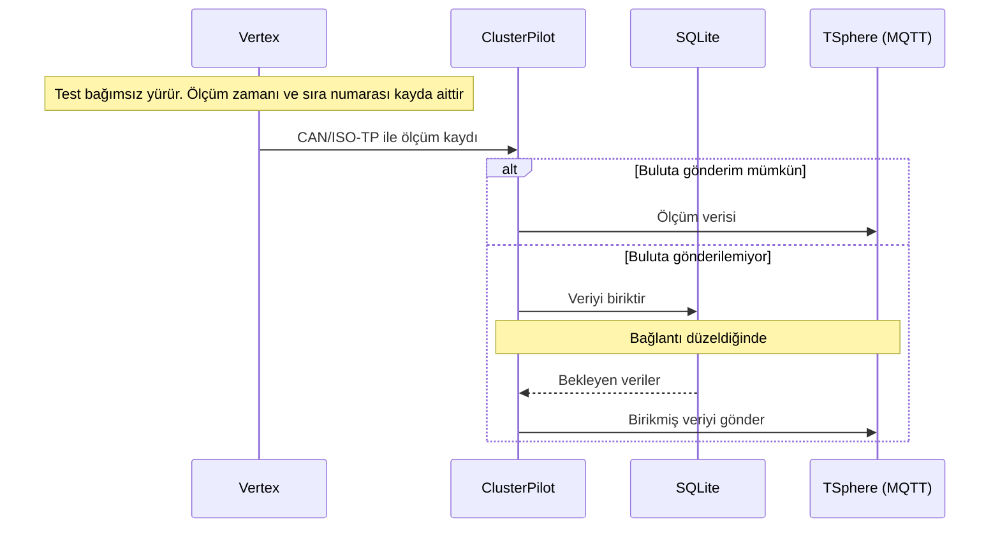
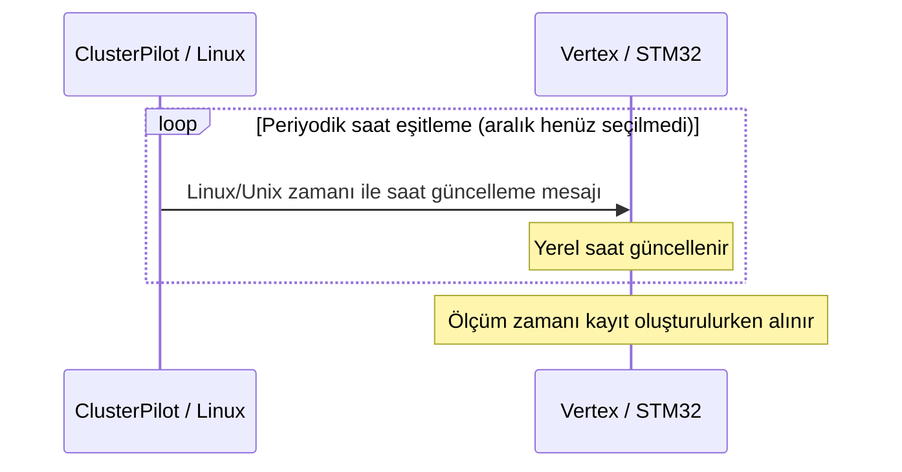
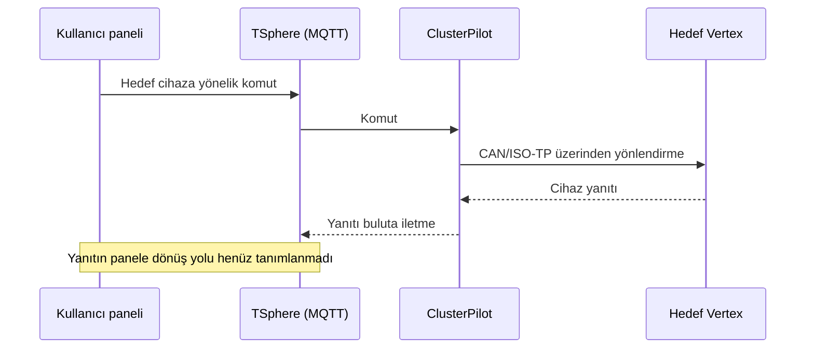

# Tronloop Mesajlaşma Protokolü — Çalışma Taslağı

**Son Güncelleme:** 2026-09-18

## Kapsam ve karar durumu

Bu belge, görüşmede kesinleşen mesajlaşma davranışlarını ve henüz tasarlanacak mesaj sözleşmelerini bir araya getirir. **Kesinleşti** kullanıcı kararını, **mevcut kod** kaynaklardan gözlemi, **öneri** değerlendirme seçeneğini, **açık** henüz seçilmemiş ayrıntıyı ifade eder. Belgenin taslak olması, aşağıda bağlantısı verilen kabul edilmiş kararları geçersiz kılmaz.

Adlandırma: **Cluster**, Vertex birimlerini içeren test grubudur; **ClusterPilot**, Linux sunucusudur; **Vertex**, testi firmware üzerinde bağımsız yürüten pil test birimidir. `__` ile biten klasörler kaynak alınmaz.

Dayanaklar: [Genel yapı](../07-decisions/ADR-0003-system-overview.md), [bağımsız test yürütme](../07-decisions/ADR-0004-autonomous-vertex.md), [dairesel tampon](../07-decisions/ADR-0006-vertex-ring-buffer.md), [zaman ve sıra numarası](../07-decisions/ADR-0007-measurement-time-sequence.md). Eski ADR-0005'in yerini ADR-0006 almıştır.

**TSphere**, bulut sunucusunun adıdır; MQTT bu sunucudaki haberleşme hizmetidir. [Adlandırma kararı](../07-decisions/ADR-0009-tsphere-name.md).

## 1. Haberleşme hatları

| Hat | Yön | Taşıma | Görev | Durum |
|---|---|---|---|---|
| COM-001 | Vertex → ClusterPilot | CAN/ISO-TP | Ölçüm verisi ve cihaz yanıtları | Kesinleşti; paket biçimleri açık |
| COM-002 | ClusterPilot → TSphere üzerindeki MQTT | MQTT | Ölçümleri ve cihaz yanıtlarını buluta iletme | Kesinleşti; konu ve içerik şeması açık |
| COM-003 | Kullanıcı paneli → TSphere üzerindeki MQTT | MQTT üzerinden mantıksal akış | Komut başlatma | Kesinleşti; doğrudan erişim/ara servis ayrıntısı açık |
| COM-004 | TSphere üzerindeki MQTT → ClusterPilot | MQTT | Hedef cihaza yönlendirilecek komutu alma | Kesinleşti; abonelik ve adresleme açık |
| COM-005 | ClusterPilot → Vertex | CAN/ISO-TP | Komut yönlendirme ve periyodik saat güncelleme | Kesinleşti; mesaj biçimi ve zamanlama açık |
| COM-006 | ClusterPilot ↔ SQLite | Yerel veritabanı | Buluta gönderilemeyen veriyi biriktirme ve yeniden gönderme | Kesinleşti; kayıt silme/onay koşulları açık |

Buluttaki verileri kalıcı depolamaya yazan servis ve panelin yanıtları alma yolu henüz tanımlanmadı. MQTT'ye gönderim, bu belgede bulut veritabanına yazıldığına ilişkin onay olarak kabul edilmez; bu onayın gerekip gerekmediği ve biçimi açık konudur.

## 1.1. Tür alanıyla ayrıştırma

**Kesinleşti — [ADR-0010](../07-decisions/ADR-0010-message-type-and-operation-mode.md):** Mesaj türü, mesajdaki tür alanından belirlenir. **Farklı türler aynı veri uzunluğunu kullanabilir.** `dataLength`, türü seçmek için değil seçilen türün paket uzunluğunu doğrulamak içindir. ADR-0008'in benzersiz uzunluk şartı yürürlükten kalktı.

Alıcı önce tür alanını okuyacak kadar veri bulunduğunu, ardından tür kodunu ve o türe ait uzunluğu doğrulayarak diğer alanları okur. Bilinmeyen tür veya geçersiz uzunluk, başka türe benzetilerek işlenmez. Gerçek alan boyutları, tür kodları ve sürüm eşlemesi açıkça belgelenecek; C enum boyutları varsayılmayacak.

## 2. Ölçüm akışı

1. Vertex, test senaryosunu kendi üzerinde yürütür ve ölçümü üretir.
2. Ölçüm kaydı, ölçüm anının zamanını ve artan sıra numarasını taşır.
3. Vertex kaydı CAN/ISO-TP üzerinden ClusterPilot'a aktarır. Kısa gönderim kesintileri dairesel tamponla karşılanır.
4. ClusterPilot aldığı veriyi TSphere üzerindeki MQTT'ye gönderir.
5. Buluta gönderemediği veriyi SQLite'ta biriktirir ve daha sonra gönderir.

Bu diyagram mantıksal akıştır; teslim onayı, SQLite işlem sınırları ve mesajların bire bir veya toplu taşınacağı konusunda karar içermez.

## 3. Ölçüm kaydının anlamı

Aşağıdaki adlar açıklama amaçlıdır; JSON anahtarı, C alanı veya ikili paket yerleşimi henüz seçilmedi.

| Bilgi | Anlamı | Karar durumu |
|---|---|---|
| Ölçüm zamanı | Ölçümün Vertex'te alındığı an; Unix zaman temeli, **milisaniye çözünürlüğü** | Kesinleşti |
| Sıra numarası | Artmaya devam eden kayıt ayırt edicisi; test değişiminde sıfırlama şartı yok | Kesinleşti |
| Ölçüm değerleri | Gerilim, akım, sıcaklık gibi deney verileri | Yeni mesajdaki kesin alan listesi, türler ve birimler açık |
| Kaynak Vertex/Cluster bilgisi | Kaydın hangi cihaza ait olduğunu belirleme | Adres/konu/paket içindeki temsil biçimi açık |
| Test kimliği | Ölçümü bir test çalıştırmasıyla ilişkilendirme | Alan olarak kullanımı ve üretimi henüz kararlaştırılmadı |

Tamponda bekleyen ölçüm aktarılırken ölçüm zamanı gönderim zamanı ile değiştirilmez. Sıra numarası tek başına tüm cihazlar veya yeniden başlamalar boyunca benzersizlik garantisi değildir. Alan genişliği, sayaç taşması ve cihaz yeniden başladığındaki davranış henüz seçilmedi.

**Anlam örneği:** Sıra 105 numaralı kayıt tamponda kaldıysa, bağlantı sonrasında aynı ölçüm zamanı ve sıra bilgisiyle aktarılır. Uzun kesintide 106–120 üzerine yazılmışsa bu kayıtlar geri getirilemez. Bu örnek mesaj kodu, aktarım sırası veya boşluk bildirim mekanizması belirlemez.

## 4. Vertex dairesel tamponu

**Kesinleşen amaç:** Normal çalışma varsayımı sürekli açık bağlantıdır. Tampon kısa kesintileri karşılar; kayıpsız arşiv değildir.

| Durum | Davranış |
|---|---|
| Bağlantı açık | Ölçümler üretilir ve ClusterPilot'a aktarılır |
| Gönderim kesildi | Test ve kayıt devam eder; veriler sınırlı dairesel tamponda tutulur |
| Tampon doldu | Yeni kayıt en eski kaydın üzerine yazılır; eski kayıt gönderilmemiş olsa da korunmak zorunda değildir |
| Bağlantı düzeldi | Tamponda hâlâ bulunan, aktarılmayı bekleyen kayıtlar gönderilir |
| Kesinti tamponun kapsadığı süreden uzun | Üzerine yazılan eski veriler kaybolabilir; bu kabul edilen davranıştır |

“ClusterPilot kalıcı kaydettiğini onaylayana kadar Vertex veriyi mutlaka korusun” önerisi kabul edilmedi. Olası aktarım onayı veya tekrar mekanizması, tamponun üzerine yazmasını engelleyen kayıpsız teslim şartına dönüştürülmeyecek.

**Açık:** Tampon kapasitesi ve bellek ortamı, kayıt sıklığı, aktarım konumunun ilerletilmesi, canlı/birikmiş veri önceliği, tekrarlar ve kayıp bildirimi. Güç kesintisinde tamponun korunacağına ilişkin karar yoktur.

## 5. Saat eşitleme

- STM32 üzerindeki RTC aktif çalışır.
- ClusterPilot, Linux/Unix zamanını **belirli aralıklarla mesajla** Vertex'e gönderir; Vertex saati güncellenir.
- Bağlantı kesilince Vertex kendi saatiyle test ve kayıt işlemine devam eder.
- Ölçüm kayıtlarının hedef çözünürlüğü milisaniyedir. Bu karar eşitlemenin 1 ms doğruluk sağlayacağına ilişkin garanti değildir.

**Mevcut kod:** `tl_rtc.c` içindeki `TL_RTC_Set(uint32_t unix_ts)` ve `TL_RTC_Get()` Unix saniyeleri kullanır. `tl_can.c` içinde ham CAN üzerinden dört bayt little-endian zaman değeriyle RTC ayarlama yolu vardır. `main.c` başlangıçta sabit `1710255720UL` değerini kurar. Milisaniye çözünürlüğü için uygulama uyarlanmalıdır. Linux tarafındaki periyodik gönderici bu incelemede doğrulanmadı.

**Açık:** Eşitleme aralığı, ilk eşitleme, saat henüz geçerli değilken kayıt davranışı, ileri/geri saat düzeltmeleri, saniye altı zaman üretimi ve yeni saat mesajının kodlanması. Eski ham CAN komutu yeni protokol için otomatik olarak kabul edilmiş değildir.

## 6. Komut ve yanıt akışı

ClusterPilot komutu doğru cihaza yönlendirir. Testin her adımı için yeni komut veya onay gönderilmesi gerekmez; senaryoyu Vertex yürütür. Senaryo aktarımı ve test kontrolü mesajları ayrıca tanımlanacaktır.

**Öneri — henüz karar değil:** Komutun alındığı, kabul/ret edildiği ve uygulandığı durumları ayırmak; komutla yanıtı eşleştiren bir kimlik kullanmak. Ölçüm sıra numarasının bu amaçla kullanılacağı kararlaştırılmadı.

**Açık:** Komut listesi, senaryo aktarımı, yanıt kodları, zaman aşımı, yeniden deneme, tekrarlanan komutlar, eski/gecikmiş komutlar, hedefe ulaşılamaması ve yetkilendirme. Cihaz yanıtlarının Vertex tamponuna veya ClusterPilot SQLite kuyruğuna dahil olduğu henüz kararlaştırılmadı.

## 7. Mesaj aileleri — öneri

Bu tablo yeni protokolün kesinleşmiş mesaj kodları değildir.

| Aile | Yön | Amaç |
|---|---|---|
| Ölçüm | Vertex → ClusterPilot → TSphere | Deney ölçümleri, ölçüm zamanı ve sıra bilgisi |
| Durum | Vertex → ClusterPilot → TSphere | Cihazın ve testin güncel durumu |
| Olay | Vertex → ClusterPilot → TSphere | Adım geçişi, test bitişi veya hata |
| Komut | Panel → MQTT → ClusterPilot → Vertex | İstenen işlemi cihaza iletme |
| Komut sonucu | Vertex → ClusterPilot → MQTT | İşlemin sonucunu bildirme |
| Saat eşitleme | ClusterPilot → Vertex | Linux zamanını Vertex'e iletme |

Ölçüm, komut/yanıt ve saat güncelleme **işlevleri** kesinleşmiştir; bunların ayrı mesaj türleri olarak kodlanması, ortak başlıkları ve durum/olay ayrımı henüz seçilmedi.

## 8. Mevcut firmware ile hedef tasarımın farkı

| Başlık | Mevcut kod gözlemi | Hedef / durum |
|---|---|---|
| Gönderilen mesajlar | `VertexTelemetryPayload` (`0x01`), `HeartbeatPayload` (`0x02`), `VertexStatusPayload` (`0x03`) | Tipler yeniden tasarıma açık |
| Hedef gönderim aralıkları | 100 ms, 500 ms, 3000 ms | Yeni protokolün gönderim sıklığı olarak onaylanmadı |
| Gelen komut başlığı | command, version, sequence, flags; her biri bir bayt, toplam dört bayt | Yeni başlık ve ölçüm sıra alanıyla ilişkisi açık |
| Komut uygulama/yanıt | İncelenen ayrıştırıcı komutları logluyor; cihaz işlemleri yorum satırında; ağ yanıtı üretmiyor | Komut yürütme ve yanıt sözleşmesi tasarlanacak |
| Ölçüm zamanı | İncelenen periyodik paketlerde yeni zaman alanı yok; RTC API'si saniye tabanlı | Milisaniye ölçüm zamanı eklenecek |
| Ölçüm sıra numarası | İncelenen periyodik paketlerde ölçüm sayacı yok | Artan ayırt edici eklenecek |
| Dairesel tampon | İstenen davranışın uygulanmış olduğu doğrulanmadı | ADR-0006 davranışı uygulanacak |

Kaynak ve alan ayrıntıları: [Vertex mevcut mesaj envanteri](vertex-message-inventory.md). Genel durum kodu kullanıcının talebiyle güncellendi ve Debug derlemesi ile bilgisayarda paket kontrolleri geçti; bu, donanım doğrulaması değildir.

## 8.1. VertexStatusPayload — genel durum mesajı

Mevcut genel durum mesajı **7 bayt**, tür alanı **0x03**, hedef gönderim aralığı **3000 ms**: tür, pil gerilimi (mV), senaryo oynatıcı durumu, charger çalışma modu (0 idle, 1 şarj, 2 deşarj) ve işaretli 2 bayt pil akımı (mA) taşır. [Bayt yerleşimi, durum kodları, veri kaynakları ve örnek paket](general-status-message.md). Ölçüm zamanı ve sıra numarası bu mevcut pakette henüz yoktur.

**Yeni karar:** Genel durum tasarımında iki şarj bayrağı yerine tek **idle / şarj / deşarj çalışma modu** kullanılacak. Oynatıcı durumu ayrı anlamını korur. Bu değişiklik Vertex firmware’ine uygulandı; alıcı yazılım henüz güncellenmedi. Oynatıcı durumu ve charger çalışma modu ayrı birer `uint8_t` (1 bayt) olarak taşınacak. Akım mA cinsinden işaretli `int16_t` olarak 2 bayt taşınacak; hedef paket **7 bayt**. Mod kodları 0 idle, 1 şarj, 2 deşarj; reverse bayrağı önceliklidir. Akım aralık dışındaysa genel durum paketi atlanıp loglanır. [ADR-0010](../07-decisions/ADR-0010-message-type-and-operation-mode.md).

Mevcut ISO-TP kütüphanesi en fazla 7 bayt uygulama verisini tek CAN çerçevesinde taşır. Bu nedenle 7 baytlık hedef genel durum ISO-TP ile tek çerçevede gönderilebilir. Telde `0x07` ISO-TP başlığı (1 bayt) + 7 bayt veri bulunur; ek dolgu yoktur. Alıcı uygulama verisi 7 bayttır. 8 bayt uygulama verisi çok çerçeveli gönderim gerektirir. [Kaynak incelemesi](general-status-message.md).

## 9. Tamamlanacak protokol ayrıntıları

| Konu | Henüz seçilmemiş ayrıntılar |
|---|---|
| Adresleme | Cluster/Vertex kimlik kapsamı, CAN ID eşlemesi ve ClusterPilot sayısı |
| İkili paket | Tür kodu–şema tablosu, türe göre `dataLength` doğrulaması, mesaj kodları, sürüm başlığı, alan boyutları, bayt sırası, tekil/toplu ölçüm |
| Ölçüm | Alan listesi, birimler, geçerlilik bilgisi ve kayıt sıklığı |
| Sayaç ve zaman | Sayaç boyutu/taşması/yeniden başlama; zaman kodlaması ve eşitleme aralığı |
| MQTT | Konular, içerik biçimi, QoS, retained kullanımı, oturum ve abonelik düzeni |
| Tampon ve kuyruk | Vertex kapasitesi/aktarım konumu; SQLite kapsamı, teslim ve silme koşulları |
| Komutlar | İşlem listesi, hedefleme, ilişkilendirme, hata kodları ve yeniden deneme |
| Bulut ve panel | Kalıcı depolama tüketicisi, panel bağlantısı ve yanıtın panele iletilmesi |

Yeni kararlar ilgili ADR kaydına bağlanarak bu belgeye işlenecek; öneriler kullanıcı kabul etmeden kesin sözleşme olarak sunulmayacak.
