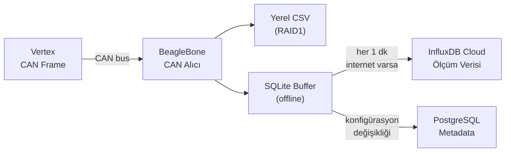

# Veri Toplama

**Son Güncelleme:** 2026-09-18

Bu sayfada ilk tasarım notları duruyor. İsimleri güncelledik ama aşağıdaki bütün seçimleri yeniden doğrulamadık. Güncel yapı için [mimari notlara](architecture-notes.md) bakıyoruz; burası geçmişte düşündüğümüz seçenekleri kaybetmemek için duruyor.

İlk veri toplama planında ClusterPilot’un ölçümleri CAN üzerinden alıp yerel RAID1 depolamaya yazmasını, sonra dakikada bir buluta göndermesini düşünmüştük. Bu sayfadaki tablolar o planı gösteriyor.

---

Bugünkü paketler için [haberleşme notlarına](communication-notes.md) bakıyoruz. Aşağıdaki CAN tablosu eski; yeni alıcıyı buna göre yazmıyoruz.

## Veri Akışı

```mermaid
flowchart LR
    N["Vertex<br/>CAN Frame"] -->|"CAN bus"| BB["BeagleBone<br/>CAN Alıcı"]
    BB --> CSV["Yerel CSV<br/>(RAID1)"]
    BB --> BUF["SQLite Buffer<br/>(offline)"]
    BUF -->|"her 1 dk<br/>internet varsa"| INFLUX["InfluxDB Cloud<br/>Ölçüm Verisi"]
    BUF -->|"konfigürasyon<br/>değişikliği"| PG["PostgreSQL<br/>Metadata"]
```

---

## CAN Frame Yapısı

İlk taslaktaki CAN veri alanı şöyleydi:

| Byte | İçerik | Tip |
|------|--------|-----|
| 0–1 | Voltaj (mV) | uint16 |
| 2–3 | Akım (mA, işaretli) | int16 |
| 4–5 | Kapasite (mAh) | uint16 |
| 6 | SoH (%) | uint8 |
| 7 | Durum flag | uint8 |

O taslakta sıcaklık ve döngü sayısı ikinci bir çerçeveye ayrılmıştı (CAN ID + 1).

---

## Cloud Sync

### Zamanlama

| Hedef | Sıklık | Koşul |
|-------|--------|-------|
| InfluxDB | Her 1 dakika | İnternet bağlantısı varsa |
| PostgreSQL | Anlık | Konfigürasyon değişikliğinde |
| Offline flush | Bağlantı gelince | SQLite buffer boşaltılır |

### Offline Tampon

Eski planda bağlantı kesilince ölçümler **SQLite**’ta bekleyecek, bağlantı gelince InfluxDB’ye toplu gönderilip silinecekti. Güncel yapıda hedef TSphere üzerindeki MQTT; kaydın ne zaman silineceğini ayrıca netleştireceğiz.

---

## Toplanan Ölçümler

| Veri | Kaynak | Hedef DB |
|------|--------|----------|
| Voltaj, akım, kapasite | BQ34Z100 → CAN | InfluxDB |
| SoH, iç empedans | BQ34Z100 → CAN | InfluxDB |
| Pil yüzey sıcaklığı | NTC → BQ34Z100 → CAN | InfluxDB |
| Ortam sıcaklığı | TMP117 → CAN | InfluxDB |
| Döngü sayısı | Firmware → CAN | InfluxDB |
| Vertex konfigürasyonu | BeagleBone | PostgreSQL |
| Deney tanımları | Kullanıcı girişi | PostgreSQL |

---

**İlgili Dosyalar:** [Yazılım Mimarisi](architecture.md) · [Analiz](analysis.md)
