*🔋 TRONLOOP — Batarya Kapasite Kayıp İzleme Sistemi*

---
# Veri Toplama

Ana ünite (BeagleBone), CAN bus üzerinden node'lardan gelen ölçümleri toplar, yerel RAID1 depolamaya yazar ve her 1 dakikada bir cloud'a senkronize eder.

---

## Veri Akışı

```mermaid
flowchart LR
    N["Node<br/>CAN Frame"] -->|"CAN bus"| BB["BeagleBone<br/>CAN Alıcı"]
    BB --> CSV["Yerel CSV<br/>(RAID1)"]
    BB --> BUF["SQLite Buffer<br/>(offline)"]
    BUF -->|"her 1 dk<br/>internet varsa"| INFLUX["InfluxDB Cloud<br/>Ölçüm Verisi"]
    BUF -->|"konfigürasyon<br/>değişikliği"| PG["PostgreSQL<br/>Metadata"]
```

---

## CAN Frame Yapısı

Her node, ölçüm verilerini standart bir CAN frame formatında gönderir.

| Byte | İçerik | Tip |
|------|--------|-----|
| 0–1 | Voltaj (mV) | uint16 |
| 2–3 | Akım (mA, işaretli) | int16 |
| 4–5 | Kapasite (mAh) | uint16 |
| 6 | SoH (%) | uint8 |
| 7 | Durum flag | uint8 |

Sıcaklık ve döngü sayısı ikinci bir frame ile gönderilir (CAN ID + 1).

---

## Cloud Sync

### Zamanlama

| Hedef | Sıklık | Koşul |
|-------|--------|-------|
| InfluxDB | Her 1 dakika | İnternet bağlantısı varsa |
| PostgreSQL | Anlık | Konfigürasyon değişikliğinde |
| Offline flush | Bağlantı gelince | SQLite buffer boşaltılır |

### Offline Tampon

İnternet bağlantısı kesildiğinde ölçümler BeagleBone üzerindeki **SQLite** veritabanına yazılır. Bağlantı geri geldiğinde tampondaki tüm kayıtlar InfluxDB'ye toplu gönderilir ve SQLite temizlenir.

---

## Toplanan Ölçümler

| Veri | Kaynak | Hedef DB |
|------|--------|----------|
| Voltaj, akım, kapasite | BQ34Z100 → CAN | InfluxDB |
| SoH, iç empedans | BQ34Z100 → CAN | InfluxDB |
| Pil yüzey sıcaklığı | NTC → BQ34Z100 → CAN | InfluxDB |
| Ortam sıcaklığı | TMP117 → CAN | InfluxDB |
| Döngü sayısı | Firmware → CAN | InfluxDB |
| Node konfigürasyonu | BeagleBone | PostgreSQL |
| Deney tanımları | Kullanıcı girişi | PostgreSQL |

---

**İlgili Dosyalar:** [Yazılım Mimarisi](architecture.md) · [Analiz](analysis.md)
