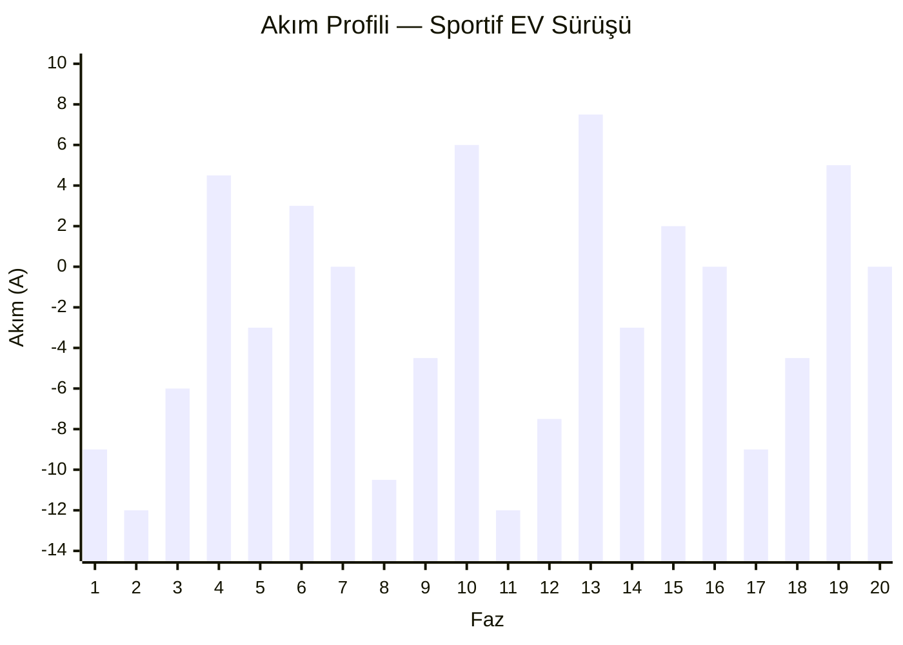
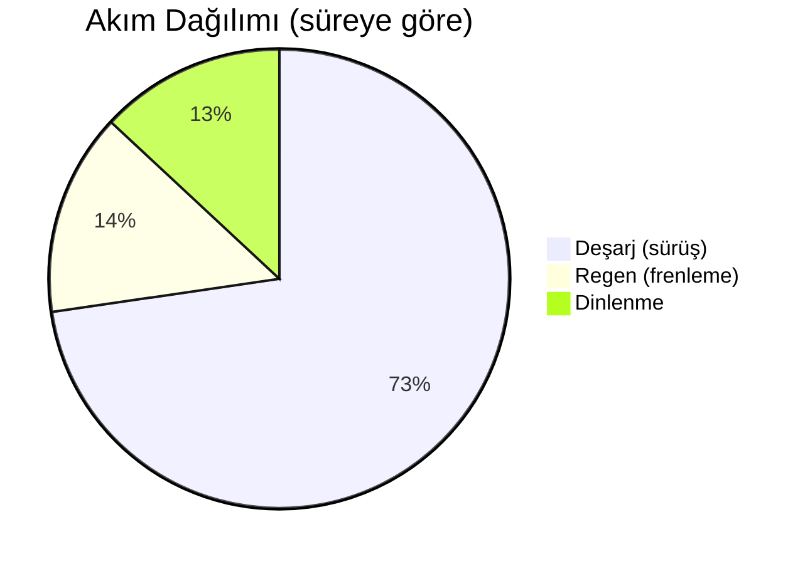
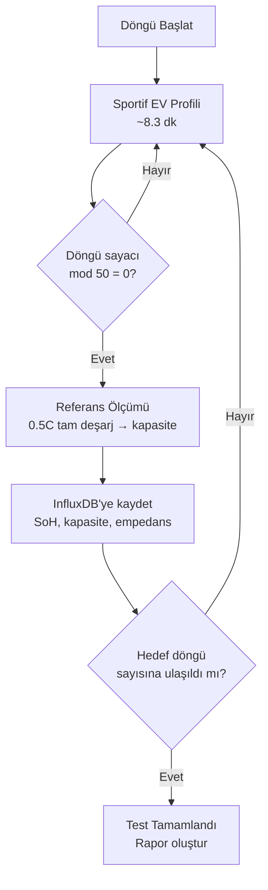

# Sportif EV Sürüş Profili — Şarj/Deşarj Test Senaryosu

**Son Güncelleme:** 2026-09-18

> **Hücre:** 3Ah LFP · **IC:** BQ25756 bidirectional buck-boost · **Döngü:** ~8 dk sürüş + dinlenme (~498 s)

Bu profil, sportif bir elektrikli araç sürüşünü simüle eden şarj/deşarj test senaryosunu tanımlar. Amaç, batarya hücrelerini gerçekçi dinamik yüklere maruz bırakarak kapasite degradasyonunu hızlandırılmış koşullarda gözlemlemektir.

## Senaryo Özeti

Profil, tipik bir sportif EV sürüşünü 20 fazda modeller: sert kalkış, otoyol sprinti, şehir içi dur-kalk trafiği, rejeneratif frenleme ve park. Her faz belirli bir akım seviyesinde sabit süre çalışır.

## Sürüş Fazları

| # | Faz | Süre (s) | Akım (A) | C Hızı | Senaryo |
|---|-----|----------|----------|--------|---------|
| 1 | **Çıkış — Tam gaz** | 30 | -9.0 | 3.0C | 0→100 km/h sert kalkış |
| 2 | **Agresif hızlanma** | 20 | -12.0 | 4.0C | 100→160 km/h tam güç |
| 3 | **Yüksek hız seyir** | 40 | -6.0 | 2.0C | 160 km/h otoyol |
| 4 | **Sert frenleme** | 10 | +4.5 | 1.5C | Rejeneratif frenleme |
| 5 | **Şehir içi dur-kalk** | 60 | -3.0 | 1.0C | Trafik, düşük hız |
| 6 | **Kısa frenleme** | 8 | +3.0 | 1.0C | Kırmızı ışık freni |
| 7 | **Dinlenme — bekleme** | 15 | 0.0 | — | Işıkta bekleme |
| 8 | **Ani hızlanma** | 15 | -10.5 | 3.5C | Geçiş manevası |
| 9 | **Orta hız seyir** | 50 | -4.5 | 1.5C | 80 km/h şehir dışı |
| 10 | **Uzun frenleme** | 15 | +6.0 | 2.0C | Yokuş aşağı regen |
| 11 | **Sprint hızlanma** | 12 | -12.0 | 4.0C | Kısa anlık burst |
| 12 | **Yüksek hız seyir 2** | 35 | -7.5 | 2.5C | 140 km/h |
| 13 | **Keskin frenleme** | 8 | +7.5 | 2.5C | Acil fren |
| 14 | **Şehir içi seyir** | 45 | -3.0 | 1.0C | Düşük hız |
| 15 | **Hafif frenleme** | 10 | +2.0 | 0.67C | Yavaşlama |
| 16 | **Boşta / park** | 20 | 0.0 | — | Motor kapalı |
| 17 | **Son sprint** | 15 | -9.0 | 3.0C | Hızlı kalkış |
| 18 | **Seyir kapanış** | 40 | -4.5 | 1.5C | Eve dönüş |
| 19 | **Rejeneratif iniş** | 20 | +5.0 | 1.67C | Garaj inişi regen |
| 20 | **Park — döngü sonu** | 30 | 0.0 | — | Dinlenme |

> **İşaret kuralı:** Negatif akım = deşarj (pilden çekilen), pozitif akım = rejeneratif şarj (pile geri besleme).

## Akım Profili Görselleştirmesi

## Döngü İstatistikleri

| Metrik | Değer |
|--------|-------|
| **Toplam döngü süresi** | 498 s (~8.3 dk) |
| **Deşarj fazı süresi** | 362 s |
| **Regen fazı süresi** | 71 s |
| **Dinlenme süresi** | 65 s |
| **Max deşarj akımı** | -12.0 A (4.0C) |
| **Max regen akımı** | +7.5 A (2.5C) |
| **Ortalama deşarj akımı** | -6.4 A (~2.1C) |
| **Tahmini deşarj kapasitesi** | ~0.64 Ah / döngü |
| **Tahmini regen geri kazanım** | ~0.07 Ah / döngü |
| **Regen geri kazanım oranı** | ~11% |
| **Başlangıç SoC** | %95 |
| **Tahmini bitiş SoC** | ~%76 |
| **Tahmini SoC düşüşü** | ~%19 / döngü |

## Akım Dağılımı

## BQ25756 Uyumu

Bu profildeki tüm akım değerleri BQ25756'nın limitleri içindedir:

| Parametre | IC Limiti | Profil Max | Durum |
|-----------|-----------|------------|-------|
| Max şarj (regen) | 10 A | 7.5 A | Uygun |
| Max deşarj | 20 A | 12.0 A | Uygun |
| Max C hızı (deşarj) | 6.6C | 4.0C | Uygun |
| Max C hızı (şarj) | 3.3C | 2.5C | Uygun |

## Test Tekrarı ve Degradasyon İzleme

Bu profil sürekli döngü olarak tekrarlanır. Her N döngüde bir referans ölçümü yapılır:

Her 50 döngüde bir yapılan referans ölçümü ile gerçek kapasite kaybı izlenir. BQ34Z100'ün Impedance Track algoritması sürekli SoH takibi yaparken, referans ölçümü bağımsız doğrulama sağlar.

## Notlar

- Akım değerleri 3Ah LFP hücre için hesaplanmıştır. Farklı kapasiteli hücreler için C hızları oranlanarak akımlar ayarlanmalıdır.
- Gerçek testte BQ25756'nın I2C registerları üzerinden akım programlanır; geçişler arasında 100ms rampa süresi bırakılır.
- Ortam sıcaklığı TMP117 ile, pil yüzey sıcaklığı NTC termistör ile paralel kaydedilir.
- Faz 1'de oda sıcaklığında (~25°C), Faz 2'de kontrollü iklim koşullarında (-20°C / +40°C) tekrarlanır.

**İlgili Dosyalar:** [Test Protokolü](test-protocol.md) · [Vertex Tasarımı](../02-hardware/node-design.md) · [Veri Toplama](../03-software/data-collection.md)
